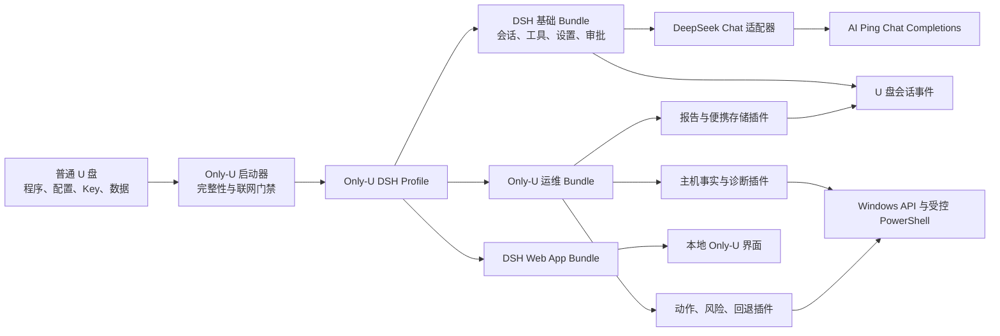
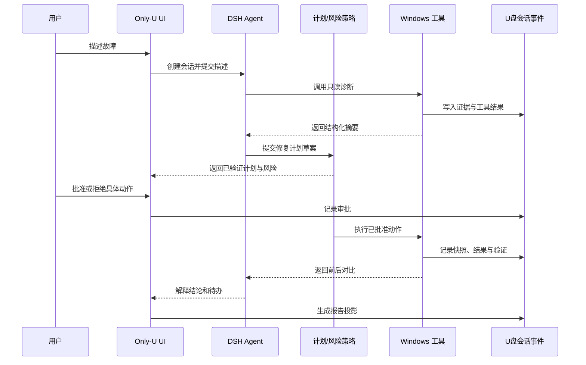

# Only-U 项目需求文档（PRD）

## 文档控制

| 项目 | 内容 |
|---|---|
| 项目名称 | Only-U |
| 项目定位 | 装载于普通 U 盘的 Windows 在线运维 Agent |
| 项目仓库 | https://github.com/23xxCh/Only-U |
| 文档版本 | V1.0 |
| 文档日期 | 2026-08-22 |
| 文档状态 | 已批准设计后的开发基线 |
| 目标读者 | 产品、研发、测试、安全、运维、黑客松评审与项目协作者 |
| 需求证据 | `docs/requirements-source/突击深圳黑客松_聊天记录.md`、需求澄清结论、当前 DeepSeek Harness 仓库能力 |

## 0. 已确认且不可在 V1 中擅自改变的决策

1. Only-U 完整支持 Windows 10 与 Windows 11；macOS、Linux 只保留未来扩展接口，不进入 V1 验收。
2. 当前唯一硬件是普通 U 盘，不购买或假设存在免驱无线网卡、流量卡、BadUSB、专用安全芯片、PE 启动介质或本地模型设备。
3. 产品以 DeepSeek Harness 为基础进行插件化二次开发。Only-U 能力通过 DSH Profile、Bundle 与 Cordis 插件交付，不直接魔改 agent loop 等内核核心。
4. 用户构成按 7:3 设计：约 70% 为 IT、桌面运维、开发者及其他技术用户，约 30% 为普通电脑用户。
5. V1 是在线产品。没有可用网络时只显示“当前无可用网络或 AI 服务不可达”，允许重试或退出，不进行离线诊断、离线修复或离线模型推理。
6. 模型服务使用团队统一的 AI Ping/DeepSeek Key。Key 以静态凭据文件形式放入实际交付 U 盘，由制作介质的流程写入；真实 Key 不进入 Git、文档、日志、会话或界面。
7. 产品运行时直接使用 DSH 的 DeepSeek Chat Completions 适配器连接 AI Ping。Codex 与 CC Switch 可以用于开发验证，但不是 Only-U 的终端用户依赖。
8. 产品是合法合规的本机运维工具，不提供后门、隐蔽驻留、凭据窃取、远程偷取资料、攻击扫描、权限绕过或一键转为网安攻击工具的能力。

---

## 1. Problem Statement

### 1.1 用户问题

公司与学校中的电脑故障大量集中在桌面运维层：系统盘空间不足、电脑卡顿或假死、驱动安装失败、打印机异常、蓝屏、系统更新失败、文件找不到、启动项过多、病毒告警、服务异常等。专业运维人员能够通过 PowerShell、事件查看器、设备管理器、系统工具和经验逐项排查，但每台电脑的环境不同，检查步骤分散、证据难以沉淀、修复过程依赖个人经验。普通用户往往无法准确描述故障，更不知道应该安装和配置哪个 Agent、Skill、MCP、脚本或模型 Key。

聊天记录中最直接的产品证据来自团队成员的真实经历：将 Claude Code 放在 U 盘中，已经在学校和公司处理过几十台电脑，但现有方式仍然需要熟练使用命令行、预先配置模型与网络、判断权限、控制删除范围，并且无法向普通用户解释每一步风险。这证明“U 盘中的通用 Agent”有实际需求，也证明直接把开发工具复制到 U 盘并不等于完成了产品化。

用户需要的不是一个拥有无限终端权限的聊天机器人，而是一套便携、可审计、受约束的 Windows 运维工作流：插入 U 盘即可启动；用户用自然语言描述问题；产品先采集证据，再形成可理解的修复计划；危险动作逐项确认；执行后进行复核；最后把报告带走。产品必须避免误删、越权、数据泄露、虚假成功和不透明的后台驻留。

### 1.2 业务问题

传统桌面运维工具通常是固定功能集合，对未预设的“奇怪 Bug”解释能力有限；通用 Agent 虽然灵活，却缺少面向电脑维修的风险分级、结构化工具、恢复措施和用户体验。Only-U 要填补两者之间的空白：保留大模型理解自然语言和编排复杂诊断的能力，同时把真正影响系统的动作限制在经过设计、测试和审计的运维插件内。

对团队而言，项目还面临明确资源约束：比赛期间没有新硬件采购，时间紧，需要复用 DeepSeek Harness 已有的插件、会话、Web、凭据、PowerShell、权限和沙箱能力。PRD 因此必须区分“V1 能做的在线 Windows 软件能力”和“未来可能依赖硬件、离线规则库或 WinPE 的能力”，避免演示承诺与工程事实不一致。

### 1.3 根因归纳

- 故障描述不标准：普通用户只会说“卡”“打不开”“突然蓝屏”，难以提供可执行的排查信息。
- 排查知识分散：命令、控制面板、系统工具、厂商文档和个人经验之间缺少统一编排。
- 修复风险过高：通用终端 Agent 可能误删文件、修改错误注册表、停止关键服务或安装不匹配的驱动。
- 环境部署复杂：安装 Node、CLI、Skill、MCP、模型 Key 与网络代理超出普通用户能力。
- 过程不可审计：口头维修通常没有完整证据、批准记录、修改清单和前后对比。
- 便携数据治理缺失：程序在 U 盘不代表 Key、会话、缓存和报告都会留在 U 盘。
- 能力边界模糊：无法进系统、硬件损坏、断网和 BIOS 故障常被错误地归入“Agent 能修”的范围。

## 2. Solution

### 2.1 用户视角的解决方案

Only-U 提供一个可从普通 U 盘启动的 Windows 运维界面。用户双击启动程序后，产品先确认系统受支持、U 盘可写、程序文件完整、网络可用且 AI Ping 凭据有效。检查通过后，用户可以从“电脑很卡”“C 盘空间不足”“驱动或打印机异常”“蓝屏”“找文件”“安全扫描”“其他问题”等入口开始，也可以直接用自然语言描述现象。

Agent 将描述转化为一组只读检查，展示采集到的事实和初步判断。修复前，产品生成包含动作、影响范围、风险、管理员权限、预计时间和恢复方式的计划。低风险读取可自动执行；删除、系统修改、驱动、服务、网络重置和安全处置必须按策略获得用户批准。执行时，Only-U 使用专用 Windows 运维工具，而不是让模型任意拼接危险命令。执行后重新检查关键指标，并把完整结果保存到 U 盘。

### 2.2 工程视角的解决方案

Only-U 作为 DSH 的 Windows 专用 Profile 与 Bundle 交付。DSH 继续负责 Agent 生命周期、模型流式调用、会话事件、工具注册、凭据引用、设置、审批、权限预设、文件系统、PowerShell 执行和 Web 客户端。Only-U 插件负责联网门禁、便携目录、Windows 主机事实、运维动作目录、风险策略、变更记录、恢复、报告和产品界面。

AI Ping 使用 OpenAI 兼容的 Chat Completions 接口，因此 Only-U 复用 DSH 的 DeepSeek Chat Completions 适配器，将模型 Base URL 指向 AI Ping，并从 U 盘凭据能力解析 Key。模型只能看到经脱敏、裁剪和结构化后的系统证据。所有实际变更都通过工具参数验证与审批层，不以提示词作为唯一安全措施。

### 2.3 价值主张

- 对 IT 人员：减少重复命令和信息收集时间，同时保留专业证据、命令结果和可控权限。
- 对普通用户：不用安装开发环境，不必理解 Agent 配置，用引导式界面完成描述、确认和报告导出。
- 对组织：得到标准化维修记录、前后对比和审计轨迹，降低经验只存在个人脑中的风险。
- 对团队：复用 DSH 插件生态，在有限时间内交付真实可运行的 Windows 运维闭环。

## 3. 产品目标、非目标与成功指标

### 3.1 V1 产品目标

1. 在受支持的 Windows 10/11 电脑上，从普通 U 盘完成“启动检查—问题描述—诊断—计划—批准—修复—验证—报告”的完整闭环。
2. 让技术用户在不手动整理十余条系统命令的情况下获得一致的诊断证据，并能够展开查看专业细节。
3. 让普通用户能够理解产品正在读取什么、准备修改什么、为什么需要管理员权限以及最终是否真的改善。
4. 将高风险动作限制在结构化、可测试的工具范围内，确保模型不能仅凭自然语言越过安全策略。
5. 保证真实 Key 不进入仓库和日志，运行数据默认写入 U 盘，正常退出后不在客户电脑留下常驻组件。
6. 形成适合黑客松演示的可重复场景，同时保持需求、实现和安全说明一致。

### 3.2 V1 非目标

- 不承诺修复无法启动到 Windows 桌面的电脑。
- 不承诺修复显示器、主板、硬盘、内存、电源等物理硬件故障。
- 不处理 BIOS/UEFI 损坏、固件刷写、硬件拆装和数据恢复实验室级任务。
- 不制作或启动 WinPE，不执行无人值守重装系统。
- 不提供 macOS/Linux 实际运维能力。
- 不在无网络时运行离线诊断、脚本知识库或本地模型。
- 不安装远控、后门、计划任务、自启动项或隐蔽常驻服务。
- 不提供密码获取、权限绕过、漏洞利用、横向移动、端口攻击扫描或资料窃取。
- 不把产品扩展为自媒体、通用办公或网络攻击平台。
- 不保证替代专业杀毒软件、厂商售后、数据恢复服务或资深系统工程师。

### 3.3 成功指标

| 指标 | V1 验收目标 | 计算方式 |
|---|---|---|
| 支持系统启动成功率 | 在测试矩阵内不低于 95% | 成功进入 Only-U 首屏的测试次数／总测试次数 |
| 启动可理解性 | 90% 的测试用户无需口头指导完成启动 | 可用性测试记录 |
| 联网门禁准确率 | 100% 区分无网络、认证失败、额度/限流和服务超时 | 故障注入用例结果 |
| 高风险动作审批覆盖率 | 100% | 高风险动作中出现明确审批记录的比例 |
| 禁止动作拦截率 | 100% | 恶意/越权工具参数被拒绝的比例 |
| 诊断报告完整率 | 100% 包含输入、证据、计划、批准、结果与验证状态 | 报告模式校验 |
| Key 泄漏测试 | 0 处 | 扫描日志、会话、报告、错误与进程环境 |
| 正常退出残留 | 0 个 Only-U 常驻服务、计划任务和自启动项 | 系统基线前后对比 |
| 核心演示完成时间 | 常见 C 盘或卡顿场景 10 分钟内完成 | 从会话开始至报告生成 |
| 虚假成功 | 0 次 | 未完成复核或等待重启的动作不得显示为成功 |

### 3.4 发布判定

V1 只有在便携启动、联网门禁、凭据读取、至少三类核心诊断、至少两类受控修复、审批与报告形成端到端闭环，并通过全部 P0 安全验收后才可称为可用版本。仅有聊天界面、仅能执行 PowerShell、仅能输出建议或仅能展示静态 Demo 均不构成 V1 完成。

## 4. 用户角色与利益相关方

### 4.1 主要角色 A：桌面运维/IT 支持

具备 Windows 基础知识，能识别进程、服务、驱动、注册表、事件日志和 PowerShell 输出。其核心诉求是快速、可重复、可审计；不希望被面向小白的界面隐藏全部专业细节。该角色可以启用专家模式，但仍受产品硬性安全策略约束。

### 4.2 主要角色 B：开发者或技术爱好者

经常被同事、同学叫去“修电脑”，能够判断 Agent 建议是否合理，但不一定是专职运维。其核心诉求是把个人经验变成便携工具，快速处理陌生电脑环境，并把维修记录带走。

### 4.3 次要角色 C：普通电脑用户

无法准确描述故障，只能提供“很卡”“没空间”“打印不了”“昨天蓝屏”等现象。其核心诉求是看得懂、少操作、不误删、知道产品为什么请求权限，并在失败时得到明确的下一步，而不是一屏技术错误。

### 4.4 管理与支持角色

- 产品维护者：定义运维动作目录、风险等级、版本和发布清单。
- 安全审查者：审查凭据、数据最小化、命令约束、权限和残留。
- 测试人员：维护 Windows 虚拟机、录制故障样本、执行兼容性与破坏性测试。
- 团队 Key 管理员：配置 AI Ping 额度、查看调用、轮换或禁用 Key。
- 黑客松评审：验证项目真实问题、技术实现、AI 使用、工程完整度与现场演示。

## 5. User Stories

1. 作为桌面运维人员，我希望从 U 盘直接启动工具，从而无需在客户电脑安装开发环境。
2. 作为普通用户，我希望看到简单的启动检查结果，从而知道产品为什么不能继续。
3. 作为团队 Key 管理员，我希望 Key 只存在实际交付介质和服务端，从而避免源代码泄漏。
4. 作为运维人员，我希望展开查看原始命令、退出码和采集时间，从而能独立复核模型判断。
5. 作为普通用户，我希望用“电脑很卡”这样的描述开始，从而不必先学习故障术语。
6. 作为运维人员，我希望 Agent 自动收集 CPU、内存、磁盘、进程、服务和事件摘要，从而减少重复操作。
7. 作为用户，我希望任何删除前都看到候选文件、大小和保护原因，从而避免误删资料。
8. 作为用户，我希望 C 盘清理优先处理确定安全的缓存和临时文件，从而降低清理风险。
9. 作为运维人员，我希望识别大目录与最近增长目录，从而定位系统盘爆满原因。
10. 作为用户，我希望清理后看到真实释放空间，从而确认操作有效。
11. 作为运维人员，我希望看到高 CPU、高内存、高 I/O 进程及其签名信息，从而判断卡顿来源。
12. 作为用户，我希望终止进程前看到程序名称、路径、发布者和影响，从而不会关闭关键系统进程。
13. 作为运维人员，我希望分析异常服务与启动项，从而减少开机慢和后台冲突。
14. 作为用户，我希望修改服务或启动项前得到确认，从而知道系统行为将发生变化。
15. 作为运维人员，我希望查看设备状态、硬件 ID、驱动版本和错误码，从而定位驱动问题。
16. 作为用户，我希望 Only-U 不自动安装来源不明的驱动，从而避免系统不稳定。
17. 作为运维人员，我希望收集打印队列、Spooler 状态和打印机错误，从而快速排查打印问题。
18. 作为用户，我希望清空打印队列前确认，从而避免丢失仍需打印的任务。
19. 作为运维人员，我希望收集 Windows 更新状态和失败码，从而判断更新故障。
20. 作为用户，我希望系统修复工具运行时显示进度和预计时间，从而不会误以为程序卡死。
21. 作为运维人员，我希望解析蓝屏转储目录、BugCheck 事件和近期驱动变化，从而形成可追踪线索。
22. 作为用户，我希望产品不声称已经修复尚未复现的蓝屏，从而避免虚假安全感。
23. 作为用户，我希望按名称、类型、大小和日期查找文件，从而快速找到资料。
24. 作为用户，我希望文件搜索默认不读取正文，从而保护隐私。
25. 作为用户，我希望整理文件时先预览移动计划，从而确认目标目录和重名处理。
26. 作为运维人员，我希望调用 Windows Defender 的现有能力，从而执行合规的安全扫描。
27. 作为用户，我希望隔离或删除威胁前看到 Defender 的检测结论，从而避免模型自行认定文件有毒。
28. 作为运维人员，我希望执行 SFC、DISM 等系统检查并结构化解析结果，从而减少手工查看长输出。
29. 作为用户，我希望需要管理员权限时才出现 UAC，从而避免产品始终以最高权限运行。
30. 作为用户，我希望拒绝 UAC 后仍能保留诊断结果，从而不会因为一个动作失败而丢失全部工作。
31. 作为运维人员，我希望修复计划按动作拆分，从而能够批准部分动作并拒绝其他动作。
32. 作为普通用户，我希望风险说明使用通俗语言，从而能做出真实知情的决定。
33. 作为专家用户，我希望展开结构化参数与底层命令，从而判断动作是否符合预期。
34. 作为安全审查者，我希望专家模式仍不能执行后门、窃密和越权操作，从而保证产品边界稳定。
35. 作为用户，我希望每个变更都有执行前值与执行后值，从而知道系统到底改变了什么。
36. 作为用户，我希望可逆动作提供回退入口，从而在副作用出现时恢复。
37. 作为运维人员，我希望不可可靠回退的动作提前标明，从而决定是否继续。
38. 作为用户，我希望网络中断后产品停止新的高风险动作，从而避免 Agent 在信息不完整时继续。
39. 作为用户，我希望恢复网络后能重试当前步骤，从而不必从头开始。
40. 作为用户，我希望无网络时只看到清楚的提示和重试，从而不会误以为离线能力可用。
41. 作为用户，我希望 U 盘意外拔出时变更动作停止，从而避免日志和恢复材料丢失。
42. 作为运维人员，我希望会话与报告写回 U 盘，从而把维修证据带走。
43. 作为客户电脑所有者，我希望正常退出后没有 Only-U 常驻服务，从而不担心被长期控制。
44. 作为安全审查者，我希望 Key 不出现在 PowerShell 子进程环境中，从而缩小泄漏面。
45. 作为 Key 管理员，我希望能通过服务端额度限制控制最坏成本，从而降低介质丢失风险。
46. 作为用户，我希望认证失败与余额不足显示不同信息，从而知道应该找谁处理。
47. 作为测试人员，我希望模型响应可重放，从而稳定验证审批、工具和报告流程。
48. 作为测试人员，我希望在可还原 Windows 虚拟机中验证真实修复，从而不伤害开发主机。
49. 作为维护者，我希望运维能力都是 DSH 插件，从而可以独立测试、替换和升级。
50. 作为维护者，我希望 Only-U 不直接修改 DSH 内核，从而降低同步上游的成本。
51. 作为产品负责人，我希望界面同时提供普通说明和技术详情，从而满足 7:3 用户结构。
52. 作为评审，我希望演示包含故障前后对比和真实报告，从而确认产品不是静态原型。
53. 作为用户，我希望操作失败时看到稳定错误码和建议，从而可以转交技术人员继续处理。
54. 作为用户，我希望等待重启的动作显示为“待验证”，从而不会把计划完成当成故障解决。
55. 作为运维人员，我希望导出机器可读 JSON，从而可将记录接入后续工单流程。
56. 作为普通用户，我希望一键生成可分享的简版报告，从而能向 IT 描述已经做过的事情。
57. 作为安全审查者，我希望报告在写盘前脱敏，从而减少用户名、路径和网络信息的暴露。
58. 作为产品维护者，我希望每个动作拥有稳定 ID 与版本，从而追踪行为和兼容性。
59. 作为用户，我希望更新 Only-U 时不会自动覆盖历史报告和凭据，从而保护已有数据。
60. 作为团队成员，我希望产品明确列出不能修的故障，从而避免做出超出能力的承诺。

## 6. 范围与优先级

### 6.1 P0 范围

P0 是首个可演示和可交付版本的阻断项：便携启动、程序完整性、Windows 10/11 判断、联网门禁、AI Ping Key 读取、模型连接、会话、主机基础体检、C 盘分析与安全清理、性能与进程分析、文件查找、Windows Defender 调用、系统完整性检查、风险分级、审批、UAC、执行记录、复核、报告、隐私脱敏、拔盘/写满处理和正常退出无驻留。

### 6.2 P1 范围

P1 在 P0 稳定后进入：服务与启动项管理、设备和驱动诊断、打印机诊断、Windows 更新诊断、蓝屏证据收集、文件整理预览、恢复动作、历史会话浏览、专家视图、报告 JSON、运行成本显示和更新介质检查。

### 6.3 P2 范围

P2 是 V1 后增强：更多驱动厂商接口、远程协作、组织策略包、离线规则库、macOS/Linux Provider、WinPE、重装系统、专用硬件、集中工单平台和多 U 盘统一管理。P2 条目不应出现在 V1 宣传中的“现已支持”列表。

## 7. 关键术语

| 术语 | 定义 |
|---|---|
| 运行 | 从用户启动 Only-U 到正常退出或异常终止的一次生命周期 |
| 会话 | 围绕一台电脑的一次故障描述、诊断、修复与报告上下文 |
| 主机事实 | 从 Windows 读取、带采集时间和来源的结构化系统信息 |
| 证据 | 支持或反驳某项判断的主机事实、工具结果或用户确认 |
| 推断 | Agent 基于证据得出的可能原因，必须与事实分开呈现 |
| 运维动作 | 由稳定 ID、参数模式、风险等级、权限与验证规则定义的可执行能力 |
| 修复计划 | 一个或多个按依赖排序、可单独审批的运维动作集合 |
| 安全模式 | 默认权限预设；只读自动，变更按风险确认，硬性禁令始终生效 |
| 专家模式 | 展开更多技术信息并减少低风险重复确认，但不取消硬性禁令 |
| 硬性禁令 | 后门、窃密、越权、攻击、隐蔽驻留等任何模式都不能执行的行为 |
| 回退材料 | 执行前保存的值、导出文件或恢复指令，用于撤销可逆变更 |
| 待重启验证 | 动作已经执行，但必须重启后才能判断最终效果的状态 |
| 便携数据根 | 位于当前 Only-U U 盘、保存配置、会话、日志和报告的目录 |
| 联网门禁 | 在开放 Agent 能力前验证网络、服务和凭据的强制启动阶段 |

## 8. 假设与约束

1. 目标电脑至少能够进入 Windows 桌面、读取普通 USB 大容量存储并启动本地可执行程序。
2. 用户可以在需要时提供管理员账号或批准 UAC；无法提升权限时只提供权限允许范围内的诊断。
3. 网络必须允许 DNS、HTTPS 和 AI Ping 域名；企业代理、证书拦截或防火墙可能导致门禁失败。
4. 静态 Key 可被能够读取 U 盘的人复制，产品通过额度、审计、轮换和最小传播降低风险，不能宣称物理防提取。
5. Windows ACL 沙箱在当前 DSH 中只能提供部分文件写入约束，因此业务动作白名单和参数验证是必需的第二层控制。
6. AI 输出具有不确定性，任何事实性结论必须引用本次会话证据，任何系统变更必须通过工具策略决定是否可执行。
7. 产品不能假设系统默认浏览器可上网；本地 Web 界面可以使用浏览器或 WebView，但模型服务连接由本地后端完成。
8. U 盘性能、容量和文件系统差异显著；写入必须原子化并在空间不足时停止新的变更。
9. 产品不将客户电脑的用户名、主机名、路径、IP、事件日志或文件清单视为可随意上传的数据。
10. DSH 上游仍在演进，Only-U 通过插件组合减少内核耦合，但每次升级仍需执行兼容性与快照回归。

## 9. 端到端用户旅程

### 9.1 标准旅程

1. 用户插入 U 盘，在资源管理器中双击 Only-U。
2. 启动器显示产品版本，依次完成文件完整性、系统支持、U 盘空间、网络、AI Ping 服务和凭据检查。
3. 用户阅读隐私与授权摘要，选择安全模式或专家模式；首次使用默认安全模式。
4. 用户选择问题入口或输入自然语言描述。
5. Agent 提出必要的澄清问题，随后执行只读诊断。
6. 界面按“发现的事实—可能原因—建议动作”展示结果，并允许展开专业详情。
7. Agent 形成按依赖排序的修复计划；每个动作显示范围、风险、权限、耗时和恢复方式。
8. 用户批准、拒绝或调整动作。需要管理员权限的动作在执行前触发 UAC。
9. 执行器逐项执行，记录开始、输出、退出码、超时、取消、前后值和回退材料。
10. Agent 重新运行关键检查，区分已解决、部分改善、失败、跳过和待重启验证。
11. 用户导出简版 Markdown/PDF 友好报告与技术 JSON 报告，结束会话并安全弹出 U 盘。

### 9.2 无网络旅程

启动器发现没有可用网络、DNS 无法解析、TLS 无法建立或 AI Ping 服务不可达时，停止后续初始化。页面只显示检查结果、简短排查提示、重试和退出；不加载 Agent 对话，不执行离线 PowerShell 诊断，也不把“网络故障修复”作为可用选项。恢复网络并点击重试后，从联网门禁重新验证。

### 9.3 权限拒绝旅程

当用户批准的动作需要管理员权限时，Only-U 显示原因并触发 UAC。用户拒绝或凭据不足后，该动作记录为“权限拒绝”，其依赖动作自动跳过，其他不依赖的只读检查可继续。报告保留建议和所需权限，用户可稍后以合适账号重试，不能把权限拒绝显示成系统故障。

### 9.4 中途拔出 U 盘旅程

运行期间检测到便携数据根不可写或介质消失时，Only-U 立即阻止新的变更动作并请求正在执行的可取消动作停止。内存中保留最小状态，在系统临时目录写入不含敏感详情的恢复标记。用户重新插入同一介质后验证运行 ID 与目录，恢复写入并把恢复标记迁回；无法恢复时仅允许查看当前状态和退出。

### 9.5 模型服务中断旅程

会话中途出现超时、限流、认证失效或服务端错误时，产品不继续推导新的修复步骤。已执行的本地动作不会自动回滚，除非其失败策略明确要求且回退安全；界面保留现有证据，允许按退避策略重试。持续失败时可导出“不完整报告”，其中明确记录中断点，不能生成虚构结论。

## 10. Functional Requirements

### FR-001 便携启动与数据根定位（P0）

**目标：** 用户在不安装 Only-U、Node.js、包管理器、Codex、CC Switch 或其他开发环境的情况下，从任意普通 U 盘盘符启动产品；所有持久化产品数据默认回到当前介质。

**参与者与前置条件：** 参与者为普通用户或技术用户。Windows 已进入桌面，系统能够识别 USB 大容量存储并允许运行本地程序。U 盘目录包含经发布清单定义的启动器、运行时、DSH Profile、Bundle、前端资源和凭据文件。

**主流程：** 启动器以自身可执行文件位置为唯一锚点解析 Only-U 根目录，不能依赖固定盘符。启动器创建本次运行 ID，计算便携数据根、日志目录、会话目录、报告目录和临时目录。它向 DSH 传入显式 Home 与 Profile，确保 DSH 不回落到当前 Windows 用户的默认配置目录。随后启动本地后端，等待健康检查成功，再打开本地界面。重复双击时，第二个实例检测已存在的同一介质实例，把界面聚焦到原实例而不是并发写同一数据库。

**业务规则：** 程序文件与用户数据必须分区存放；升级程序时不得覆盖历史会话、报告和实际 Key。路径计算必须支持盘符变化、中文用户名、空格、长路径和大小写差异。产品不得在注册表中登记系统级安装信息，不创建卸载项。为满足运行时需要而产生的系统临时文件必须绑定运行 ID，并在正常退出时清理。

**异常与降级：** 根目录不可读时显示介质读取错误；数据根不可写或剩余空间低于发布阈值时不开放会话；端口被占用时选择受控的可用回环端口，不监听公网接口；后端启动超时后停止子进程并提供错误码。路径解析发现数据根不在启动介质时必须失败，不得悄悄把长期数据写入系统盘。

**输出与验收：** 输出包含运行 ID、产品版本、介质根目录、数据根、后端状态和本地界面地址。验收在至少 E、F、G 三种盘符、含中文与空格路径、两次连续启动和重复启动场景执行；结果必须进入同一受控实例，且系统盘上不存在长期 Only-U 会话目录。

### FR-002 发布文件完整性与版本一致性（P0）

**目标：** 在加载任何可执行插件或读取真实 Key 前，发现被破坏、缺失、版本不匹配或非发布清单内的关键程序文件，避免运行不完整介质。

**前置与输入：** 输入为随版本发布的签名清单，清单包含版本号、文件相对路径、大小、哈希、必需/可选标记和兼容的配置模式版本。清单本身必须有能够被启动器验证的真实性证明；比赛原型至少使用内置公钥验证签名，不能仅把可修改的哈希文件与程序放在同一目录而宣称可信。

**主流程：** 启动器先验证清单，再按清单检查启动器以外的关键运行文件。必需文件缺失、哈希不符或配置模式超出支持范围时，启动失败并列出受影响的相对路径，不继续加载 DSH。可选资源缺失时进入有限模式，但必须明确说明具体缺失能力。用户数据、会话、报告和凭据不参与程序哈希比较，升级后保持有效。

**业务规则：** 检查结果不得把真实 Key 内容、哈希输入或绝对客户路径上传给模型。清单允许声明某些由发布流程写入的文件只检查权限和格式，不固定内容。任何来自 `plugins` 或等价扩展目录的新可执行插件必须出现在清单；V1 不支持用户随意放入未签名插件。

**异常与验收：** 检查过程被取消、文件读取失败或介质断开时均视为完整性未确认。验收需分别篡改一个 JS Bundle、删除一个运行时文件、修改一个非关键说明文件和更新一个历史报告；前三种应按清单策略阻止或降级，历史报告变化不得阻止启动。

### FR-003 Windows 平台、架构与基础依赖检查（P0）

**目标：** 在产品继续运行前明确判断当前主机是否属于 V1 支持范围，并为后续工具提供稳定的系统能力事实。

**主流程：** 启动器通过系统 API 获取 Windows 产品名、版本、Build、架构、当前进程架构、PowerShell 可用版本、系统区域和代码页、当前用户类型、管理员令牌状态、长路径能力、系统盘、临时目录、可用内存与 U 盘文件系统。检查结果进入运行元数据，但只把故障处理需要的部分发送给模型。

**业务规则：** Windows 10 与 Windows 11 的仍受微软支持或团队测试覆盖的 Build 进入支持状态；Windows Server、Windows 8.1 及更早系统进入不支持状态。ARM64 若发布包未包含经过测试的运行时，应显示架构不支持，不能尝试运行 x64 修复。系统语言不同不能成为拒绝理由，输出解析应优先使用结构化 API 或机器格式而非匹配中文/英文提示。

**异常与输出：** 无法确定版本或系统 API 返回冲突信息时进入“平台无法确认”，不执行变更。输出以卡片呈现“支持”“有限支持”或“不支持”，同时记录精确 Build 与架构供报告使用。

**验收标准：** 在 Windows 10 x64、Windows 11 x64 的测试版本正确进入支持状态；Windows Server 和模拟未知 Build 被阻止；中文、英文系统得到相同结构字段；普通用户与管理员启动均能准确报告权限状态。

### FR-004 联网门禁与 AI 服务健康检查（P0）

**目标：** 严格实现“没网就提示没网”的产品决定，防止用户在 AI 不可用时误以为 Only-U 能够离线诊断或继续修复。

**主流程：** 门禁分层执行：确认至少一个非回环网络接口处于可用状态；解析 AI Ping 域名；建立 HTTPS/TLS 连接；调用低成本健康或模型接口；使用 U 盘凭据进行最小认证请求；确认配置模型可用。界面逐项显示当前步骤，但不展示请求头或 Key。所有层均成功后才挂载可创建会话的 Agent 界面。

**错误分类：** 无网络接口或系统报告无互联网为 `NETWORK_UNAVAILABLE`；DNS 失败为 `DNS_FAILURE`；证书和 TLS 为 `TLS_FAILURE`；连接超时或 5xx 为 `SERVICE_UNAVAILABLE`；401/403 为 `CREDENTIAL_REJECTED`；429 根据响应区分额度耗尽与速率限制；模型不存在为 `MODEL_UNAVAILABLE`。错误分类必须以响应状态和稳定字段为依据，不从自由文本中猜测 Key 值。

**业务规则：** V1 不在门禁失败后运行系统诊断，不自动修改代理、DNS、网卡或防火墙。页面可以给出不超过三条通用建议，例如检查网络连接、企业代理和系统时间，但不能声称已定位网络故障。重试应重新执行完整门禁，不复用过期成功状态。门禁成功后仍需为会话中途断网提供独立处理。

**验收标准：** 通过禁用网卡、错误 DNS、TLS 拦截、无效 Key、额度响应、错误模型、服务超时和正常连接八类故障注入，界面必须给出不同稳定代码；任何失败下工具注册虽可在后端完成，但前端不得允许用户发起 Agent 回合或本地诊断。

### FR-005 U 盘静态凭据读取与隔离（P0）

**目标：** 按已选择的 B 方案使用团队统一 Key，同时把凭据传播范围限制在模型适配器和必要的健康检查中。

**前置与介质制作：** 团队在制作实际 U 盘时使用专用写入流程创建凭据文件。仓库、构建产物模板和测试介质不得包含真实 Key。凭据文件包含凭据类型、Key 值、版本与可选失效提示，不保存个人 AI Ping 控制台密码。文件可以应用隐藏、只读和 ACL，但产品文档必须明确普通 U 盘不能抵御物理读取。

**主流程：** 启动器验证文件存在和格式后，将其作为 DSH 凭据引用注册。DeepSeek 适配器在每次请求前通过凭据能力读取 Key，健康检查通过受限接口请求临时取得同一引用。通用 PowerShell、子进程、前端和报告生成器均只接收“凭据可用/不可用”状态，不接收 Key 文本。

**保护规则：** 禁止把 Key 放入命令行参数、URL 查询、Cordis YAML、前端状态、剪贴板、错误 cause、遥测属性、会话事件或通用环境继承。日志脱敏器必须同时识别完整 Key、Bearer 头和常见 Key 前缀。即使用户在聊天中要求“显示当前 Key”，Agent 也只能说明凭据状态与来源介质，不能读取或回显。

**异常与验收：** 文件缺失、空值、包含换行注入、超过长度限制、读取权限失败或服务端拒绝时，门禁失败并给出不泄密的错误。自动化测试在 Key 放置于凭据文件后扫描进程命令行、子进程环境、会话数据库、日志、报告和 UI DOM，任何完整或部分敏感值出现均判定失败。

### FR-006 启动隐私告知与使用模式选择（P0）

**目标：** 在采集主机信息前形成清晰、可记录的用户知情过程，并让 7:3 用户结构选择合适的信息密度。

**主流程：** 门禁成功后显示简短告知：Only-U 会读取系统信息、可能把必要的脱敏证据发送到 AI Ping、所有系统变更需按风险确认、报告默认写入 U 盘、产品不会常驻。用户必须主动点击继续。随后选择安全模式或专家模式，首次默认安全模式；历史选择可以保存在 U 盘但不能跳过告知版本变更。

**安全模式规则：** 默认折叠原始命令，使用通俗说明；只读动作可以自动执行；低风险写操作根据动作目录策略确认；中高风险逐项确认。专家模式展开命令、对象 ID、原始摘要和依赖关系，可以批量批准同级低风险动作，但不能改变硬性禁令、数据最小化和恢复要求。

**审计与异常：** 告知版本、时间、选择模式和用户点击进入会话事件。用户拒绝时立即退出，不采集诊断事实。无法写入同意记录时不开放变更能力；可以允许用户查看启动错误，但不能继续到诊断。

**验收标准：** 新介质第一次运行必须显示告知；更新告知版本后再次显示；模式切换只影响呈现和允许的审批聚合，不影响同一运维动作的风险等级与禁止策略。

### FR-007 会话创建、恢复与状态机（P0）

**目标：** 每次维修工作具有可恢复、可审计且不会混入其他电脑数据的会话。

**状态模型：** 会话依次处于 `CREATED`、`DESCRIBING`、`DIAGNOSING`、`PLAN_READY`、`AWAITING_APPROVAL`、`EXECUTING`、`VERIFYING`、`COMPLETED`、`INCOMPLETE` 或 `CANCELLED`。异常不会直接改写历史状态，而是追加错误事件并进入可解释的终态或可重试状态。`COMPLETED` 只表示工作流结束，不自动代表故障解决；结论另有 `RESOLVED`、`IMPROVED`、`UNRESOLVED`、`NOT_EXECUTED`、`PENDING_REBOOT`。

**主流程：** 创建会话时记录运行 ID、匿名主机指纹、Windows 摘要、当前权限、产品版本、动作目录版本、模式和用户输入。恢复会话时验证仍是同一主机与同一产品数据根；主机不匹配时只允许只读查看和导出，不允许继续执行旧计划。会话从 DSH 追加事件重建，不维护一份可能与日志冲突的“最终状态真相”。

**业务规则：** 一个会话同时只允许一个执行中的修复计划。用户可以在诊断阶段追加信息；执行阶段的新消息进入队列，不能改变正在运行工具的参数。取消会话必须向可取消工具传播取消信号，等待工具进入稳定状态后生成不完整报告。

**验收标准：** 在诊断、等待批准、执行中断和等待重启四个位置强制关闭程序，重新启动后能够准确恢复已记录状态，不重复执行已成功动作，不把旧主机计划应用到另一台电脑。

### FR-008 问题入口、自然语言描述与澄清（P0）

**目标：** 允许普通用户从模糊现象开始，同时为技术用户提供快速、精确的入口。

**入口：** 首屏提供“电脑卡顿”“C 盘空间不足”“驱动/设备”“打印机”“蓝屏/崩溃”“文件查找与整理”“安全扫描”“Windows 更新”“其他问题”。入口只设置初始诊断意图，不直接执行变更。自由文本支持中文为主，可以包含错误码、软件名和发生时间；V1 不要求语音输入。

**澄清规则：** Agent 最多先提出三项与选择诊断分支直接相关的问题，例如故障开始时间、是否持续、最近是否安装软件或更新、用户是否允许扫描某个目录。能从系统事实读取的信息不得反复询问。涉及文件内容、个人目录或高影响操作时不能用一次笼统同意覆盖后续具体授权。

**安全规则：** 用户输入被视为不可信数据。输入中的命令、网页内容或文件文本不能覆盖系统安全规则，不能使 Agent 注册新工具或改变动作风险等级。用户要求后门、窃密、绕过权限、攻击或隐藏驻留时，产品拒绝并解释 Only-U 仅用于获得授权的本机维护。

**输出与验收：** 输出为结构化问题摘要，包括现象、范围、时间、用户目标、已知变化和允许检查范围。以“电脑很卡”“C 盘红了”“打印不了”“昨天蓝屏一次”和恶意越权请求作为用例，前三类进入正确诊断意图，恶意请求不触发任何危险工具。

### FR-009 主机基础体检与事实采集（P0）

**目标：** 为所有诊断提供一次轻量、结构化且可复核的系统基线，避免模型在没有事实时猜测。

**采集范围：** Windows 版本与启动时间、CPU 与当前负载、物理内存与提交量、系统盘及固定磁盘容量、U 盘容量、前台/后台高资源进程摘要、关键服务总体状态、设备错误数量、Windows Update 待重启标志、Defender 状态、最近严重系统事件数量、网络接口摘要和当前权限。基础体检不递归扫描用户文件，不读取文档内容，不运行耗时的 SFC/DISM 或完整杀毒。

**主流程：** 主机事实插件并行执行可安全并行的只读采集，每项有独立超时与来源。结果规范化为带时间、单位、来源和状态的字段。单项失败不会丢弃其他项，而是将该项标记为不可用及原因。Agent 获得摘要和按需查询句柄，不一次发送全部原始事件日志。

**业务规则：** 采集命令必须使用机器可解析输出；单位统一，百分比限定范围；进程路径和用户名默认脱敏；网络信息不包含保存的 Wi-Fi 密码；Defender 被第三方安全软件替代时显示“由其他安全提供方管理”，不直接认定防护关闭。

**输出与验收：** UI 显示健康概览和异常项，技术详情显示来源和采集时间。测试通过模拟单项超时、访问拒绝、第三方防病毒、无电池台式机、多个磁盘和中文系统，保证不会因一个可选指标失败而终止整个体检。

### FR-010 诊断证据、推断与建议的分层呈现（P0）

**目标：** 防止模型把相关性当因果，把不完整诊断当确定结论，让用户能够理解并质疑判断。

**呈现模型：** 每个诊断结论由一个或多个证据引用支持。证据卡显示事实名称、值、采集时间、来源工具和可信状态；推断卡显示可能原因、置信等级、支持证据、反证或缺失信息；建议卡显示下一步只读检查或修复动作。普通视图使用自然语言，专家视图显示稳定证据 ID、工具 ID、退出码和裁剪后的原始摘要。

**业务规则：** 没有证据引用的内容只能作为“需要确认的可能性”，不能进入高风险计划。相互矛盾的证据必须并列呈现。来自用户描述的内容标记为“用户陈述”，不能伪装成系统采集事实。工具输出超过限制时保留头尾、关键字段和完整输出的 U 盘引用；裁剪行为本身写入事件。

**异常与验收：** 当模型生成不存在的证据 ID、引用已失效事实或把失败工具当成功时，计划验证器拒绝生成可执行计划，并要求模型重新整理。验收使用故意矛盾的磁盘数据、工具超时和用户错误描述，确保界面不显示无证据的确定性结论。

### FR-011 磁盘与系统盘占用分析（P0）

**目标：** 找到 C 盘空间不足的可解释原因，并在不读取无关文件正文的前提下形成可清理候选。

**输入与范围：** 默认分析系统盘容量、可用空间、文件系统、卷健康、卷影副本占用、休眠文件、页面文件、Windows 更新缓存、临时目录、回收站、浏览器缓存的聚合大小、用户目录一级分类和超过阈值的大文件。用户可明确增加其他固定磁盘或目录。扫描范围必须规范化为本机绝对路径，拒绝网络共享、设备路径、卷影路径和超出用户授权的根目录。

**主流程：** 先读取卷级指标，再进行分层目录统计。扫描器以目录聚合为主，只在大文件列表需要时输出文件元数据。扫描持续显示已处理对象数、当前目录、耗时和可取消状态。对访问拒绝、循环重解析点、损坏条目和路径过长分别计数，不因单个对象失败终止。结果按“系统可清理”“应用缓存”“用户文件”“未知/需人工判断”分类。

**业务规则：** 默认不计算每个小文件的内容哈希，不打开文档，不跟随离开授权根的符号链接或重解析点。系统保护目录不得成为普通文件删除候选。目录统计的估算与精确值必须标记，不能把估算值作为清理后承诺。扫描对主机资源设定 I/O 与并发上限，避免为了查空间把卡顿电脑进一步拖慢。

**输出与验收：** 输出包含卷摘要、Top 目录、大文件、最近增长线索、分类空间和扫描遗漏。验收覆盖大目录、拒绝访问、目录联接循环、稀疏文件、长路径、回收站和多个用户资料，结果不能重复计数同一对象，取消后必须保留“扫描不完整”标记。

### FR-012 C 盘安全清理（P0）

**目标：** 在用户知情且有可核验结果的情况下释放系统盘空间，默认不删除用户资料。

**候选类型：** V1 P0 可自动提出的候选仅包括经规则确认的系统/用户临时文件、过期产品缓存、回收站内容、Windows 错误报告、缩略图缓存、明确可重建的下载缓存和 Only-U 自身旧临时文件。浏览器缓存、更新缓存、转储文件和日志根据影响进入单独确认。用户文档、桌面、下载、图片、视频、源码、虚拟机、邮件数据和未知应用目录只能列为“大对象”，不能自动加入删除计划。

**主流程：** 清理器把候选细化到稳定对象集合，计算可释放空间，应用保护规则，展示分类、路径范围、文件数量、最旧/最新时间、预计效果和副作用。用户可以取消整类或展开排除对象。批准后重新检查对象身份和大小，避免扫描与执行之间被替换；优先使用回收站或应用自身清理接口，只有规则允许的缓存才永久删除。完成后重新读取磁盘可用空间，并报告实际释放值。

**安全规则：** 禁止通配符扩展到未展示范围；禁止递归删除盘符根、用户资料根、Windows 根、Program Files 根和 Only-U 运行根；禁止跟随重解析点；正在使用或权限不足的文件记为跳过。永久删除动作至少为中风险，并明确不可通过 Only-U 恢复。清空回收站需单独批准，因为其影响包含用户主动删除但尚可恢复的文件。

**异常与验收：** 文件在执行前变化、锁定、权限拒绝、磁盘错误或介质断开时单项失败，不得扩大权限或切换到粗暴命令。验收使用受保护测试树和诱导性重解析点，证明只能删除批准集合；实际释放值与卷前后差值可解释；用户资料测试文件保持不变。

### FR-013 性能与卡顿诊断（P0）

**目标：** 把“电脑很卡”的模糊描述拆解为 CPU、内存、磁盘、进程、启动、更新和安全扫描等可验证方向。

**主流程：** 执行短时采样而非单点读取，收集总 CPU、每核心负载、可用内存、提交限制、分页活动、主要磁盘活动、磁盘队列、响应时间、Top 进程资源变化、系统运行时间和电源计划。采样时长与频率由动作配置控制，默认数十秒内完成。Agent 将持续高负载与瞬时峰值分开，结合用户发生时间和前后台软件形成推断。

**业务规则：** 只有连续多个样本异常才能标记“持续高负载”。高内存占用不等于内存泄漏；磁盘 100% 活动不等于磁盘损坏；长时间开机只能作为建议重启的证据之一。产品不读取进程内存内容，不注入进程，不使用内核驱动。硬件温度在没有可靠系统接口时显示不可用，不从无关传感器猜测。

**建议范围：** 可建议关闭特定用户应用、暂停非关键任务、调整启动项、释放磁盘、完成更新或进一步检查磁盘健康。不能仅因资源高就终止系统进程、杀毒进程、远程会议或用户未保存工作的应用。

**验收标准：** 使用受控 CPU、内存和磁盘负载分别测试，报告应识别主导资源；短峰值不标为持续异常；采样本身的 CPU 与 I/O 不得超过性能预算；取消后不留下采样进程。

### FR-014 进程分析与受控终止（P0）

**目标：** 帮助用户识别高资源、无响应或可疑位置的进程，并在必要时安全结束明确目标。

**诊断信息：** 进程 ID、名称、可执行路径、发布者签名状态、启动时间、父进程、当前用户、会话、CPU/内存/I/O 摘要、响应状态和是否属于受保护类别。命令行参数默认脱敏并折叠，因为其中可能包含文档路径、URL Token 或密码。

**主流程：** Agent 先通过进程工具查询目标，再提出“等待”“正常关闭窗口”“停止用户应用”“结束进程树”等候选动作。优先请求应用正常退出；强制终止为中风险，显示未保存数据可能丢失。执行前复核 PID 与启动时间，防止 PID 被复用后终止错误进程。进程结束后再次确认状态和资源变化。

**硬性保护：** 系统关键进程、登录、安全子系统、Only-U 自身、模型连接、U 盘写入进程、杀毒核心与策略保护列表不能由模型终止。发布者未知或路径异常只构成安全扫描线索，不能直接判定恶意。用户要求“把所有占内存的都关掉”时，产品必须细化到候选并逐项说明。

**异常与验收：** 权限不足、进程已退出、正常关闭超时和受保护进程分别返回稳定结果。验收确保 PID 复用保护有效，强制结束测试应用会出现确认，系统保护列表始终拒绝，失败不会自动升级到更强终止方式。

### FR-015 服务与启动项诊断和管理（P1）

**目标：** 定位异常服务、开机慢和后台冲突，同时避免通过“优化”禁用系统关键能力。

**诊断范围：** Windows 服务名称、显示名、状态、启动类型、服务账号、二进制路径、签名、依赖与恢复策略；启动项覆盖受支持的注册表位置、启动文件夹和任务计划程序中的登录触发项。产品只展示与故障有关或显著影响启动的条目，不把完整任务计划内容默认发送给模型。

**主流程：** 对停止的自动服务结合事件错误和依赖判断是否异常；对启动项结合发布者、路径、影响估计和用户意图提出禁用建议。变更计划分别定义启动、停止、重启服务，修改启动类型，禁用/启用启动项。每个动作保存原值，执行后复核，并提供恢复原设置的动作。

**保护规则：** Windows 核心、安全、网络登录、磁盘、更新依赖和 Only-U 当前依赖服务进入禁止或高风险清单。模型不得创建新服务、计划任务或启动项；V1 也不允许修改服务二进制路径与账号。禁用未知项不能以“看起来没用”为理由，必须有用户目标和证据。

**验收标准：** 在测试服务和测试启动项上完成查看、修改、验证与回退；对核心服务请求始终拒绝；依赖服务未满足时给出明确原因；恢复后设置与基线一致。

### FR-016 在线状态下的网络配置诊断（P1）

**目标：** 在联网门禁已经通过的前提下，为“网络慢、部分网站打不开、代理异常”等问题采集证据；不改变“完全无网时只提示”的 V1 边界。

**范围：** 网络接口、地址、网关、DNS、系统代理、WinHTTP 代理、路由摘要、AI Ping 延迟与丢包替代指标、DNS 解析耗时和受控 HTTPS 测试。产品不读取 Wi-Fi 明文密码，不扫描局域网主机，不枚举开放端口，不捕获其他应用数据包。

**主流程：** 只读检查区分本地接口、DNS、代理、目标服务和一般 HTTPS。建议可以包括刷新 DNS 缓存、重置 WinHTTP 代理、重新获取 DHCP 或重置网络栈，但这些变更均为中高风险，可能中断当前模型连接，必须在计划中说明并安排为最后动作。动作执行前把当前配置保存到 U 盘，执行后若连接中断，产品不能依赖模型完成报告，而应由本地执行器写入结果。

**限制与验收：** 门禁未通过时该功能不可进入。企业代理与证书配置不由产品擅自移除。验收分别模拟错误 WinHTTP 代理、慢 DNS 和用户拒绝重置；诊断应指出证据，拒绝后不改变配置，批准动作必须有执行前快照。

### FR-017 设备与驱动诊断（P1）

**目标：** 为打印机、网卡、显卡、音频和常见外设问题收集设备状态与驱动证据，避免盲目安装驱动。

**诊断信息：** 设备实例 ID、类别、友好名称、状态、问题码、硬件 ID、当前驱动供应商、版本、日期、签名状态、匹配 INF 和近期相关系统事件。普通视图隐藏冗长 ID，专家视图可复制。查询不要求安装自定义驱动或内核组件。

**主流程：** Agent 根据问题入口筛选设备类别，识别禁用、未知、错误码、驱动缺失或近期变更。V1 优先提供启用设备、重新扫描硬件、打开系统设备管理页面、回滚到系统已有驱动、调用 Windows Update 可用驱动等受控建议。任何安装动作必须使用本地已存在或 Windows 信任来源，验证签名与硬件匹配，显示供应商、版本和回退条件。

**限制：** 不在 U 盘内置全量驱动包，不从搜索结果随意下载 EXE，不刷固件，不修改驱动签名策略，不绕过 Secure Boot，不自动安装跨型号驱动。网卡完全无驱动导致无网络时，因门禁无法通过，V1 只显示无网提示，不进入离线驱动修复。

**验收标准：** 使用测试设备输出和实验机分别验证错误码解析、禁用设备、签名驱动与不匹配驱动。错误硬件 ID 或未签名包必须被执行器拒绝；等待重启的驱动动作不得提前标记已修复。

### FR-018 打印机与打印队列诊断（P1）

**目标：** 覆盖公司桌面运维中常见的打印失败、队列卡住、Spooler 异常和驱动问题。

**诊断范围：** 已安装打印机、默认打印机、端口、在线/离线状态、驱动名称、队列任务摘要、错误状态、Print Spooler 服务和近期打印服务事件。文档名可能包含敏感内容，默认只显示任务数量、所有者脱敏值、状态和时间，技术视图也不上传完整文档名，除非用户明确授权。

**主流程：** 先判断是单任务、队列、服务、端口还是设备驱动问题。可执行动作包括取消选定测试任务、清空明确打印队列、重启 Spooler、恢复默认打印机和打开系统疑难解答。清空队列前列出任务数量并警告所有待打印工作将丢失；重启服务前记录依赖和当前状态。

**限制与验收：** 不自动添加未知网络打印机，不扫描打印服务器，不下载第三方驱动。验收在测试打印队列中分别制造卡住任务和停止服务，确保只影响选定队列；任务名脱敏；恢复后服务状态与队列结果可复核。

### FR-019 Windows Update 诊断与受控修复（P1）

**目标：** 解释更新失败、等待重启和更新组件异常，避免把所有系统问题都归因于更新。

**诊断范围：** 当前更新策略摘要、最近安装记录、失败代码、待安装/待重启状态、相关服务、系统盘空间和组件存储健康摘要。域管理设备要识别组织策略，不能建议绕过管理员控制。

**主流程：** Agent 关联错误码、磁盘空间、服务状态和时间，提出释放空间、重启相关服务、再次检查更新、运行官方疑难解答或组件修复等动作。任何清理更新缓存或重置组件的操作都是高风险编排：先停止正确服务、保存必要状态、只操作明确目录、重新启动服务并验证。需要重启的结果进入待验证状态。

**限制：** 不关闭组织更新策略，不修改 WSUS 地址，不卸载安全更新作为默认修复，不从非微软来源下载更新包。若系统 Build 超出团队测试矩阵，报告建议转交人工而非执行激进重置。

**验收标准：** 用录制错误输出和可还原虚拟机验证常见失败码、空间不足、待重启与策略管理场景；清理动作必须逐步记录，任何中间失败都尝试恢复必要服务并生成不完整结果。

### FR-020 蓝屏与崩溃证据收集（P1）

**目标：** 在系统已经重新进入 Windows 后收集蓝屏线索，帮助技术人员判断下一步；不承诺自动修复硬件或不可复现崩溃。

**采集范围：** BugCheck 事件、可靠性监视器摘要、转储配置、Minidump 文件元数据、崩溃时间、停止码、涉事模块线索、近期驱动/更新变化、磁盘和内存检查历史。默认不把完整内存转储上传给模型；大文件留在本机，只提取经过验证的摘要。

**主流程：** 先确认用户所述时间与系统事件是否一致；存在小型转储时使用受支持的本地解析能力或导出供人工分析；没有转储时检查配置与磁盘空间并解释证据不足。建议可能包括更新/回滚明确驱动、运行系统完整性和硬件诊断、观察复现。涉及驱动的动作继续受 FR-017 约束。

**结论规则：** 单次模块名不能证明该驱动是根因；`ntoskrnl` 等核心模块出现不等于系统内核自身损坏。未复现、未重启验证或硬件嫌疑只能标记为未解决或需人工。禁止生成“已修复蓝屏”的结论，除非有明确复核周期和无再发生证据；V1 现场通常只能给出“完成处置，待观察”。

**验收标准：** 以多组脱敏转储摘要、无转储、磁盘空间不足和近期驱动变化用例验证；报告必须分开事实与可能性，不能上传完整转储或泄漏其中潜在私人数据。

### FR-021 文件定位（P0）

**目标：** 按名称、扩展名、大小、修改时间和用户指定目录快速找到文件，同时默认保护内容隐私。

**主流程：** 用户描述文件名片段、类型、可能位置或时间；产品把条件转为结构化搜索请求，显示将搜索的根目录和过滤条件。搜索器遍历元数据，流式返回结果，支持取消、排序、分页和打开所在目录。默认根为用户明确选择的目录，不默认扫描所有用户资料和所有磁盘。

**业务规则：** V1 默认不做全文索引，不读取正文，不预览私人内容。快捷方式、重解析点和云占位文件必须标记，搜索不能为了读取云占位而自动下载。结果包含路径、大小、修改时间和类型；普通视图可以隐藏用户名路径段，用户选择具体结果后才执行打开操作。

**高风险操作：** “精准删文件”必须转入独立删除计划，显示完全限定路径、对象身份、大小和是否可回收。搜索结果本身不能携带一键永久删除。名称相同的多个文件必须让用户区分，Agent 不能自行猜选。

**验收标准：** 在包含中文名、同名文件、隐藏文件、长路径、链接和云占位的测试树中返回准确结果；搜索取消及时；未授权根不被访问；无全文授权时工具调用记录不存在文件正文。

### FR-022 文件整理与移动预览（P1）

**目标：** 帮助用户按规则整理明确选定的文件集合，所有移动在执行前可预览且可回退。

**主流程：** 用户选择源目录和整理意图，例如按年份、文件类型或项目名称分类。Agent 生成结构化规则，整理器只对元数据计算移动计划，不立即改动。预览列出源、目标、创建目录、重名策略、跨卷情况、预计数量与大小。用户可以排除对象、修改规则，然后批准。

**执行规则：** 默认不覆盖同名文件；使用稳定的重命名或跳过策略，并在预览中明确。跨卷移动采用复制、校验、再删除源文件的事务式步骤；校验失败保留源文件。每项移动写入回退清单，允许在目标未被后续修改时移回。打开、锁定、云占位和权限不足对象记为跳过。

**限制：** 不自动整理系统目录、应用数据、源码仓库内部、邮件数据库和用户未选择的根。分类不能基于读取正文，除非未来单独获得文件内容授权；V1 的规则以名称、扩展名、时间和目录为主。

**验收标准：** 使用同名、跨卷、锁定、长路径和中途取消用例，证明预览与实际动作一一对应；没有批准时零文件变化；回退后源目标与基线一致或明确列出因外部修改无法回退的对象。

### FR-023 Windows Defender 状态与扫描（P0）

**目标：** 复用 Windows 内建安全能力完成状态查询和用户授权的扫描，不让模型自行扮演杀毒引擎。

**诊断范围：** Defender/Windows Security 提供方状态、实时保护摘要、定义版本与更新时间、最近扫描、当前威胁和历史检测摘要。存在第三方安全产品时，产品识别其管理状态并避免擅自重新开启 Defender 冲突功能。

**主流程：** 用户可选择快速扫描、选定目录扫描或在专家模式下发起完整扫描。动作显示范围、预计时间、资源影响和能否取消。Only-U 调用受支持的 Defender 接口，流式显示状态，不解析扫描中的每个私人文件名上传给模型。检测结果由 Defender 产生，Agent 只解释严重性和可选处置。

**处置规则：** 隔离、允许、还原或删除威胁都是高风险动作，必须引用 Defender 检测 ID 和目标，逐项批准。Only-U 不以文件位置、扩展名或模型判断代替恶意软件检测。产品自身文件被检测时停止运行并提示人工核验，不能自动把自己加入排除项。

**验收标准：** 使用 EICAR 等合规测试样本、无威胁目录、第三方防病毒状态和过期定义用例；检测由 Defender 证据驱动；Key 与无关文件名不进入报告；取消扫描不会留下孤儿 Only-U 进程。

### FR-024 系统文件与组件完整性检查（P0）

**目标：** 以受控方式运行 Windows 官方系统检查与修复工具，并准确呈现长时任务、权限、退出结果和重启要求。

**动作目录：** 只读或验证优先，包括组件存储检查、SFC 验证；在证据支持且用户批准时，运行 SFC 修复或 DISM 修复。具体命令由版本化动作模板构造，模型只选择动作和参数，不自由拼接开关。

**主流程：** 执行前检查管理员权限、系统版本、待重启状态、电源和系统盘空间。运行中显示阶段、持续时间、可取消性和输出摘要；原始日志路径保留在本机。完成后结合退出码、官方日志关键结果和后续验证分类为未发现问题、发现并修复、发现但无法修复、执行失败或待重启。

**安全规则：** 不并发运行多个组件修复，不强行终止处于不可安全取消阶段的系统工具，不删除组件存储目录，不使用来源不明的映像。若 DISM 需要网络源而企业策略不允许，停止并建议人工配置，不自动使用随机下载源。

**验收标准：** 使用录制输出覆盖各结果分支，另在虚拟机运行真实检查。非管理员请求先审批和 UAC；超时不能直接杀死系统服务；报告必须引用退出码与日志证据，不能仅依据模型文本声明成功。

### FR-025 Windows 事件与可靠性证据查询（P1）

**目标：** 从大量事件中提取与用户问题时间和组件相关的最小证据，而不是把整个事件日志上传给模型。

**主流程：** 用户问题摘要提供时间窗和组件线索。事件查询工具只访问白名单日志与允许的 Provider，按级别、事件 ID 和时间过滤，在本地聚合重复事件，输出计数、首末时间和有限样本。可靠性信息以应用崩溃、Windows 失败、硬件错误和更新事件分类。

**隐私规则：** 消息中的用户名、路径、网络地址、文档名和命令行按字段脱敏；原始事件仅在用户主动展开本地查看时读取。默认时间窗优先覆盖故障发生前后，避免扫描数月无关数据。安全审计日志和身份验证详情不属于普通诊断范围。

**推断规则：** 事件级别“错误”不自动等于当前故障根因；重复警告需结合时间、组件和其他事实。查询失败、日志被清空和事件服务不可用分别记录，不能解读成“没有错误”。

**验收标准：** 使用包含重复事件、敏感路径、多语言消息和无权限日志的录制样本，聚合数量与时间准确；发送给模型的摘要不包含被配置为敏感的字段；无结果与查询失败在 UI 中明显不同。

### FR-026 修复计划生成与模式校验（P0）

**目标：** 把模型建议转换成可审查、可执行、可追踪的动作图，禁止模型直接以自由文本驱动系统变更。

**计划结构：** 每个计划包含计划 ID、目标、引用证据、动作列表、依赖关系、总体风险、预计耗时、是否可能中断网络、是否要求重启和完成判定。每个动作必须引用动作目录中的稳定 ID 与版本，提供完全符合模式的参数、目标对象、风险等级、权限、前置检查、成功验证、失败策略和回退能力。

**主流程：** Agent 根据诊断事实提出计划草案；计划验证器检查证据存在、动作已注册、参数合法、目标在允许范围、依赖无环、风险未被模型降低、所需恢复材料可获取、模式允许执行以及动作之间没有已知冲突。验证失败时只把稳定错误与允许修正的字段返回 Agent，不把未经验证的动作展示为可执行计划。

**业务规则：** 模型不能在参数中放入完整 PowerShell 脚本、命令连接符、重定向、编码命令或任意可执行路径，除非该动作模式明确就是受限命令且执行器进行二次解析。计划生成与计划执行分开；用户在诊断后新增信息会使相关计划过期，必须重新验证。计划中的预计释放空间、耗时和成功概率均标记为估计，不能代替执行结果。

**验收标准：** 使用不存在工具、伪造证据、循环依赖、目录逃逸、风险降级、命令注入和正常计划样本；前六类必须在执行前被拒绝且零系统变化，正常计划能够稳定序列化、恢复和审计。

### FR-027 运维动作风险分类（P0）

**目标：** 用确定性的产品策略决定审批、权限和恢复要求，风险不能由模型临场自由判断。

**等级：** `R0 只读` 不改变主机持久状态；`R1 低风险` 只修改明确可重建的缓存或产品自身数据；`R2 中风险` 可能中断应用、网络或改变用户设置，但可较可靠回退；`R3 高风险` 涉及系统组件、驱动、服务、注册表、威胁处置、永久删除或需要重启；`RX 禁止` 为产品不允许的行为。动作目录给出最低风险等级，运行时可因目标范围、不可回退、企业策略或证据不足上调，不能下调。

**策略矩阵：** R0 在告知后可自动执行；R1 在安全模式按分类确认、专家模式可批量批准；R2 必须显示对象与影响并明确批准；R3 必须逐项批准，要求技术细节、回退说明和必要的 UAC；RX 不呈现批准按钮，只解释拒绝。涉及多个对象时，风险按最高等级计算，同时保留对象级选择。

**硬性 RX 示例：** 创建隐蔽账户、关闭安全审计、转储密码、读取凭据库、修改安全策略以绕过限制、安装远控后门、持久化计划任务、攻击其他主机、清除痕迹、禁用 Defender 排除自身、绕过驱动签名以及删除未明确授权的用户资料。

**验收标准：** 同一动作在安全和专家模式保持相同最低风险；目标从测试缓存扩大到用户目录时自动上调或拒绝；模型声称“用户很着急”不能改变风险；每个注册动作都有风险单元测试和审批快照。

### FR-028 用户审批与部分批准（P0）

**目标：** 让用户对具体系统变化作出真实、可记录的决定，而不是用一次“全部同意”掩盖未知动作。

**主流程：** 审批卡展示动作名称、目的、证据、对象范围、预计影响、风险、权限、是否可回退和验证方式。用户可以批准、拒绝、展开详情或返回修改计划。独立动作允许部分批准；拒绝一个动作后，依赖它的动作自动标记跳过并说明依赖，其他动作保持可执行。

**业务规则：** 审批绑定计划版本、动作参数摘要、对象身份和会话，计划改变后旧批准失效。批准有有效期，长时间等待或主机事实变化后重新确认。界面不得使用默认勾选、模糊按钮或倒计时自动批准。普通模式必须用通俗语言描述最坏合理影响；专家模式增加命令预览但不能只显示命令而省略影响。

**审计：** 记录批准/拒绝时间、模式、动作、风险、参数摘要和告知版本，不记录 Windows 密码或 UAC 凭据。Agent 不能代替用户点击，自动化接口也必须显式提供授权主体和策略。

**验收标准：** 修改计划参数后旧批准不可执行；部分批准只运行允许项；拒绝依赖项正确传播跳过；双击批准不会重复执行；页面刷新后仍能恢复审批状态而不会自动继续。

### FR-029 管理员权限与 UAC 提升（P0）

**目标：** 仅在具体已批准动作需要时请求管理员权限，并保证提升进程只能执行该动作集合。

**主流程：** 动作元数据声明权限要求。执行器在普通权限下完成前置检查和审批，然后生成包含动作 ID、参数、会话、过期时间和随机挑战的最小提升请求。受信任的提升代理触发 UAC，验证请求来源、签名、过期和动作策略后执行，结果通过本地受限通道返回。一次提升可以执行用户已批准且同时展示的紧密动作批次，不能成为后续任意命令通道。

**业务规则：** Only-U 启动器默认不要求管理员；不缓存 Windows 管理员密码；不关闭 UAC；不使用绕过技术。用户拒绝、凭据不足或企业策略阻止时，动作记为权限拒绝，不自动重复弹窗。提升代理不继承模型 Key和无关环境变量，不监听公网，不长期驻留。

**验收标准：** R0 诊断不弹 UAC；管理员动作只在批准后弹出；篡改、重放、过期或扩大参数的提升请求被拒绝；用户拒绝后会话与报告可继续；退出后不存在提升代理进程或服务。

### FR-030 结构化动作执行器（P0）

**目标：** 将系统修改限制在版本化实现中，统一处理参数、超时、取消、输出、权限和验证。

**执行接口：** 执行器接收动作 ID、动作版本、已验证参数、会话上下文、批准令牌和取消信号。返回开始时间、结束时间、状态、退出码、结构化结果、裁剪输出引用、前后事实、回退材料引用和稳定错误。执行器在运行前再次验证对象身份、路径范围、主机状态与批准绑定。

**主流程：** 解析动作；检查策略；准备回退材料；获得所需权限；执行最小命令或系统 API；持续发送进度；解析输出；运行后置验证；原子写入动作事件。输出解析不依赖单一系统语言，优先对象/JSON/XML/退出码。PowerShell 以参数数组和固定脚本资源运行，禁止把用户或模型文本直接插入脚本。

**失败策略：** 超时、取消、非零退出、部分成功、验证失败和输出无法解析必须分开。只有明确声明安全可取消的动作才接受强制停止；系统组件工具进入不可取消阶段时，界面说明并继续等待。执行器崩溃后恢复会话时先检查动作实际状态，不能无条件重跑。

**验收标准：** 所有 P0 动作通过统一接口；命令注入字符作为普通参数处理或被模式拒绝；超时与取消产生确定状态；同一动作 ID/版本在录制输入上得到稳定解析；进程树在退出后全部回收。

### FR-031 动作依赖、互斥与中断控制（P0）

**目标：** 保证多个运维动作按安全顺序执行，避免相互干扰或在前置失败后继续破坏性步骤。

**规则：** 计划是有向无环图。动作可以声明依赖、互斥资源、是否允许并行、失败后的依赖传播和是否造成网络/重启边界。读同一事实可并行；写同一目录、服务、设备、网络栈或系统组件的动作互斥。会中断 AI 连接的动作自动排在所有需要模型推理的步骤之后，并由本地执行器完成剩余记录。

**主流程：** 调度器只选择依赖已成功、批准有效且互斥资源可用的动作。依赖失败或拒绝后，后继标为跳过；独立分支可以继续。用户按“停止”时不再启动新动作，向可取消动作发送请求，等待不可取消动作达到稳定点，然后进入不完整验证。

**验收标准：** 构造并行只读、同目录写入、网络重置、依赖失败和取消计划；执行顺序符合声明，没有两个互斥动作并发；网络重置后无需模型也能写入本地结果；停止操作不产生新的动作开始事件。

### FR-032 变更前快照与回退（P0/P1）

**目标：** 对可逆系统变更保存足够、受控的恢复信息，同时诚实标记不可逆动作。

**快照类型：** 文件移动记录源目标与身份；注册表保存精确值与类型；服务保存状态与启动类型；启动项保存原配置；网络保存接口、DNS 与代理设置；驱动保存当前包标识与系统回滚可用性；删除缓存只保存对象清单，不虚假声称可以恢复永久删除内容。需要时可请求 Windows 系统还原点，但不能假设所有系统已启用或还原点一定成功。

**主流程：** 动作在执行前调用对应快照器，验证快照写入 U 盘成功并计算完整性值。无法创建必需快照时，动作不上线执行；如果动作被明确标记为不可回退，审批卡必须单独说明。回退是新的受控计划，需要检查当前状态是否已被用户或其他程序继续修改，避免覆盖后续合法变化。

**数据规则：** 回退材料可能包含路径和配置，应留在 U 盘、按会话分区并脱敏展示。材料设置保留期限或由用户手动删除；实际 Key 不属于快照。回退执行与原动作同样记录、审批和验证。

**验收标准：** 在文件移动、测试注册表值、测试服务和代理设置上完成变更与回退；外部修改后回退必须检测冲突并停止；不可回退清理的界面不得出现“可恢复”承诺。

### FR-033 修复后验证与结论（P0）

**目标：** 用执行后的事实判断效果，杜绝“命令退出 0 就等于用户故障解决”。

**主流程：** 每个动作定义技术后置条件；计划定义与用户目标相关的复核检查。清理检查实际可用空间；服务检查状态与事件；进程检查是否退出及资源变化；系统修复结合工具结果；文件移动检查源目标；Defender 结合检测状态。Agent 将技术验证和用户体验确认结合，询问“问题是否仍然出现”时不得诱导回答。

**结论：** `RESOLVED` 要求关键验证满足且用户目标可确认；`IMPROVED` 表示指标改善但仍有问题；`UNRESOLVED` 表示验证不满足；`NOT_EXECUTED` 表示未实施建议；`PENDING_REBOOT` 表示必须重启后确认。多个问题并存时分别给结论，再计算会话总体状态。

**业务规则：** 等待重启、无法复现、证据不足、用户未确认都不能标为已解决。模型总结必须引用验证证据。重新诊断发现新问题时新建建议，不改写先前动作结果。

**验收标准：** 用“命令成功但指标未改善”“部分释放空间”“动作被拒绝”“需重启”和真实改善五种用例，结论必须正确；报告与 UI 使用同一结构结论，不出现相互矛盾的成功文案。

### FR-034 运维报告生成与导出（P0）

**目标：** 为普通用户、技术人员和后续系统提供真实、可追踪的维修交付物。

**报告结构：** 文档头包含产品版本、运行/会话 ID、时间、匿名主机摘要和完整性状态；正文包含用户问题、检查范围、关键事实、可能原因、修复计划、批准/拒绝、执行结果、前后对比、最终结论、待办与风险；技术附录包含动作 ID、版本、退出码、错误码和裁剪输出引用。机器报告使用版本化 JSON 模式。

**主流程：** 报告器从追加会话事件和运维结构事件生成，不以模型最后一条自由文本作为事实来源。生成前执行脱敏、Key 扫描、大小限制和引用完整性检查。默认导出 Markdown 与 JSON；用户需要打印/PDF 时提供浏览器打印友好页面，不要求 V1 自研 PDF 引擎。

**业务规则：** 报告写到当前 U 盘，文件名使用安全时间和短会话 ID，不包含用户名。失败、跳过、拒绝与待重启不能被摘要隐藏。用户可选择普通简版或技术完整版；简版减少路径和命令，但不改变结论。报告默认不上传、不自动发送和不生成公网分享链接。

**验收标准：** 同一会话重复生成得到事实一致的报告；模式校验通过；完整 Key 和配置的敏感样本均不出现；异常会话可生成明确标注“不完整”的报告；技术动作数量与会话事件一致。

### FR-035 历史会话浏览、删除与主机隔离（P1）

**目标：** 技术用户可在 U 盘中查找历史维修记录，同时避免把一台电脑的计划应用到另一台电脑。

**主流程：** 历史列表按时间、匿名主机、问题类型和结论显示，支持搜索与打开只读详情。会话恢复先比较匿名主机指纹与关键系统事实；不匹配时禁止继续执行，只能复制文字、导出报告或基于当前主机创建新会话。历史删除要求选择具体会话，显示将删除的会话、附件、回退材料与报告范围。

**业务规则：** 删除不能接受盘符根或通配范围，不能删除实际 Key、其他会话或程序。存在仍可使用的回退材料时提示后果。会话索引损坏时可从事件目录重建；重建失败的条目标记损坏，不静默丢弃。

**验收标准：** 两台虚拟机使用同一 U 盘产生记录，列表能够区分；在第二台打开第一台记录只能只读；删除单一记录不影响其他记录和凭据；损坏索引可恢复已完整写入的会话。

### FR-036 模型错误、限流与重试（P0）

**目标：** 在 AI Ping 出现传输、认证、额度、限流、上下文或服务错误时保持可解释状态并控制成本。

**分类与处理：** 401/403 停止并要求检查团队凭据；额度耗尽停止并联系 Key 管理员；速率限制读取合法 Retry-After，在上限内退避；5xx 和传输错误允许有限重试；上下文超限触发 DSH 压缩或开启新会话建议；请求无效记录请求 ID 并停止重复；流中断只在 DSH 能保证步骤幂等时重试。

**业务规则：** 重试次数、退避和超时由配置定义，不无限循环。涉及工具执行的模型步骤重试不能重复调用已完成动作，恢复必须依赖会话事件。错误界面不显示原始 Authorization 或完整请求。成本与调用次数写入本地统计，Key 管理员可以通过 AI Ping 控制台核对。

**验收标准：** 模拟所有错误类别，状态、按钮和重试次数符合策略；连续 5xx 达到上限后停止；401 不反复请求；工具执行后流中断不会重复变更；服务恢复后可以从安全步骤继续。

### FR-037 U 盘空间、写入健康与拔出保护（P0）

**目标：** 在低速、写满、只读或意外拔出的介质上保护会话和变更可恢复性。

**主流程：** 启动时检查可写性、可用空间和文件系统；运行中周期性检查数据根与剩余空间。事件、快照和报告使用原子写或事务存储，关键动作在开始前预留必要日志/回退空间。介质消失或写失败时停止新变更，向 UI 发出本地内存事件，提示重新插入原介质。

**业务规则：** 不把系统临时盘作为无提示的长期替代。为了在拔盘后显示错误，可以写最小恢复标记，但其中不包含主机详情、Key 或完整工具输出。重新插入后必须验证介质身份与运行目录，不能把状态写入另一支同名 U 盘。

**验收标准：** 在可控环境模拟写满、只读、拔出、插入另一介质和重新插入原介质；变更调度停止，数据库保持可恢复，错误不泄密，另一介质不被写入当前会话。

### FR-038 紧急停止与安全退出（P0）

**目标：** 用户随时能够停止 Agent 继续发起动作，并以明确方式结束本地服务和子进程。

**主流程：** 界面持续提供“停止当前任务”，执行页另提供“停止并退出”。停止先关闭新的模型与工具调度，再取消可取消动作，等待不可取消系统工具进入稳定点，刷新事件与报告状态。退出关闭本地端口、后端、浏览器辅助进程和提升代理，清理运行临时目录，并展示可安全弹出提示。

**业务规则：** 紧急停止不等于强制断电，不能粗暴杀死正在提交系统组件的工具。若无法立即停止，界面必须解释当前动作和预计安全点。Windows 关机或用户注销事件触发同样的收尾路径，但时间不足时优先保证事件与回退材料落盘。

**验收标准：** 在空闲、模型生成、文件扫描、可取消脚本和不可安全取消的模拟系统工具阶段分别测试；停止后不启动新动作；退出后回环端口关闭、子进程树清理、无服务/计划任务/自启动项残留。

### FR-039 专家视图与技术证据（P1）

**目标：** 满足 70% 技术用户的复核效率，不迫使其从简化文案猜测底层行为。

**内容：** 专家视图显示工具和动作 ID、版本、结构化参数、执行用户、是否提升、工作目录、固定命令模板渲染、退出码、持续时间、原始输出裁剪说明、证据 ID、系统对象 ID和回退材料。用户可以复制脱敏技术摘要，不可复制 Key。

**交互规则：** 专家模式允许筛选事件、展开依赖图、批量批准符合条件的 R1 动作和导出技术报告。它不开放任意 PowerShell 控制台作为产品能力；需要手动命令时，Only-U 可以生成建议供技术人员另行评估，但该命令不进入受控执行器。

**验收标准：** 普通与专家视图基于同一事件数据，结论与动作状态一致；专家视图不会因为展开而重新执行查询；复制内容通过脱敏；切换模式不改变已批准动作参数。

### FR-040 版本更新与介质维护（P1）

**目标：** 允许团队安全更新 U 盘程序，同时保护实际 Key、历史会话、报告和回退材料。

**主流程：** V1 采用团队维护者执行的介质更新，不在客户电脑后台自动更新。更新包具有签名清单和兼容声明；维护工具检查目标是 Only-U 介质，备份当前程序清单，以分阶段目录写入新版本，验证后原子切换。数据模式迁移先备份索引并支持失败恢复。

**业务规则：** 更新包不包含真实 Key；更新过程不覆盖凭据文件和用户数据根；不兼容迁移必须阻止并说明所需中间版本。更新失败后旧程序仍可启动，不能留下程序文件混合版本。只有团队信任的更新源可以进入发布流程。

**验收标准：** 从前一测试版本升级，历史记录与凭据仍可用；篡改包、空间不足和中途拔盘不切换版本；失败后完整性检查仍通过旧版本；升级后的报告记录新产品版本。

### FR-041 能力拒绝与转人工建议（P0）

**目标：** 当故障超出产品能力或请求违反边界时，给出明确、诚实且有帮助的终止路径。

**拒绝场景：** 无法进入 Windows、显示器无输出、BIOS/固件、疑似物理硬盘损坏、需要拆机、数据恢复、无网络、macOS/Linux、企业策略禁止、没有必要权限、后门/窃密/攻击请求、缺少可靠恢复方式的高风险动作以及证据不足的重大变更。

**主流程：** 产品说明不能继续的具体边界、已安全收集的证据、用户不应尝试的危险操作和合适的下一支持渠道，例如组织 IT、设备厂商、数据恢复机构或现场硬件工程师。可以导出已有证据报告，但不生成伪造的修复步骤。

**验收标准：** 每类拒绝场景有一致文案和错误/边界代码；拒绝后零禁止工具调用；报告准确标记未执行；技术用户仍能获得已采集的非敏感证据。

## 11. Non-Functional Requirements

### NFR-001 安全性

1. 所有系统变更必须由版本化运维动作执行，模型自由文本不得直接进入高权限 Shell。
2. 所有动作必须具有最低风险等级、参数模式、目标范围、权限、超时、取消、验证和回退声明；缺任一关键声明的写动作不得注册。
3. RX 禁止行为在安全模式、专家模式、自动化调用和管理员权限下均不可执行。
4. Windows ACL 沙箱报告为部分强制时，界面和日志不得把它宣称为完整隔离；业务动作策略继续独立执行。
5. P0 发布前必须通过目录逃逸、重解析点、命令注入、批准重放、参数篡改、PID 复用、UAC 请求篡改和恶意模型输出测试。
6. 产品正常退出、崩溃恢复和更新后均不得新增常驻服务、计划任务、隐藏账户、系统级自启动或未说明防火墙规则。
7. 任何永久删除动作都必须使用完全限定对象集合，执行前再次校验身份；产品不存在“清空所有没用文件”这种未定义动作。

### NFR-002 凭据与供应链安全

1. 真实 AI Ping Key 不得进入 Git 历史、Markdown、测试快照、构建缓存、发布日志和错误跟踪。
2. 凭据只由 U 盘凭据 Provider、联网门禁和模型适配器读取；通用子进程环境不得继承。
3. 发布包具有可验证清单；插件、运行时和前端关键资源均纳入清单，未签名扩展默认拒绝。
4. 团队为 Only-U 使用独立 Key 和独立额度策略。介质丢失后可以立即在服务端禁用，而无需收回所有软件版本。
5. 依赖版本由锁文件固定；发布构建在干净环境可重复产生同一程序清单。高风险依赖更新必须重新执行安全回归。
6. 日志脱敏采用“记录前处理”，不能先把秘密写盘再异步清理。秘密扫描是发布门禁而不是人工约定。

### NFR-003 隐私与数据最小化

1. 默认只采集完成当前故障所需的系统元数据；文件正文、浏览器凭据、聊天数据库、私钥和身份验证日志不在默认范围。
2. 发送到 AI Ping 的每项主机事实必须可在会话报告中追溯其来源和脱敏状态，但报告不保存实际请求头。
3. 原始大输出留在 U 盘，模型接收裁剪摘要；裁剪规则保留关键错误、退出码和计数，不能只保留支持模型结论的片段。
4. 报告默认本地导出，不自动上传、分享或建立公网链接。用户主动分享属于产品外操作。
5. 会话删除必须精确作用于选定记录；删除前说明报告和回退材料影响。Key 与其他会话永不随单会话删除。
6. 正常退出后，系统临时目录中不保留可识别客户信息；无法删除的残留必须向用户列明。

### NFR-004 性能与资源控制

1. 在典型办公电脑上，从双击到展示启动检查界面的目标时间不超过 3 秒；从检查开始到正常联网门禁通过的目标时间不超过 10 秒，外部服务超时另计并显示阶段。
2. 基础体检目标在 30 秒内给出首批结果，并持续更新；单项慢查询不阻塞全部结果。
3. 空闲时 Only-U 后端 CPU 平均占用目标低于 2%，内存目标低于 500 MiB；实际阈值在首个可运行包上基准确认，超出必须分析而非删除指标。
4. 磁盘扫描默认限制并发与 I/O，用户前台操作仍应可响应；取消请求目标在 2 秒内停止创建新扫描任务。
5. 工具输出采用流式与大小上限，不能因事件日志、目录列表或 PowerShell 输出过大耗尽内存。
6. U 盘写入使用批次和原子提交，避免每个流式 Token 都触发介质同步；关键批准和动作结果仍需及时落盘。

### NFR-005 可靠性与恢复

1. 会话事件采用追加或事务方式持久化，进程崩溃后最后一个完整事件之前的数据可恢复。
2. 已完成的写动作具有稳定幂等判断；恢复时先查询实际状态，不依赖“最后 UI 显示到哪里”。
3. 网络重试、模型重试和工具重试分别管理，不能把同一个“重试”同时重复系统动作。
4. 每个外部调用都有有限超时、取消和稳定错误分类。没有任何无限等待且无进度的用户流程。
5. U 盘写满或断开优先停止新变更；恢复标记不包含敏感信息。重新插入错误介质不能接管原会话。
6. 更新失败后旧版本仍可启动；数据迁移失败保留备份，不以空数据库覆盖历史。

### NFR-006 兼容性与便携性

1. 支持团队测试矩阵中的 Windows 10/11 x64；ARM64 只有在实际发布并测试原生运行时后才进入支持列表。
2. 支持中文与英文 Windows，路径支持 Unicode、空格和长路径。输出解析不得只匹配某一种语言的人类文案。
3. U 盘盘符可变化；程序不能写死 A、D、E 等盘符，也不能以当前工作目录代替程序根。
4. 本地服务只绑定回环地址，端口可动态选择。企业防火墙阻止回环时给出明确错误，不自动放行公网规则。
5. 文件系统至少验证常见 NTFS、exFAT 介质差异。依赖 NTFS ACL 的保护在 exFAT 上必须报告不可用，不能假装生效。
6. 产品不依赖客户电脑已安装 Node.js、Git、Python、CC Switch 或 Codex；所有必要运行时随发布包提供并纳入清单。

### NFR-007 可用性与可访问性

1. 普通用户主要流程每屏有一个主操作；风险卡不使用纯技术术语作为唯一解释。
2. 所有颜色状态同时使用文字和图标，不仅靠红绿区分；键盘可访问启动、对话、审批、停止和报告操作。
3. 长任务显示正在做什么、已经多久、能否取消和下一阶段；不可安全取消时明确说明。
4. 错误页面提供稳定代码、普通说明和技术详情展开区，避免只显示堆栈。
5. 普通视图与专家视图共享事实，不允许普通视图为了“好看”隐藏失败或把部分成功改写为成功。
6. 首次可用性测试至少覆盖 5 名技术用户和 5 名普通用户；90% 能在无口头指导下完成启动、发起诊断、审批一个动作并导出报告。

### NFR-008 可维护性与上游兼容

1. Only-U 能力通过 Cordis 插件、Bundle 和 Profile实现，不直接修改 DSH agent loop。确有缺口时先形成独立架构决定和上游兼容方案。
2. 每个插件只承担清晰职责，Service Definition、Provider 与 Consumer 角色完整；跨插件使用稳定接口而非读取内部文件。
3. 所有部署可变参数进入经过验证的配置，不在实现中硬编码模型、超时、扫描阈值和报告保留期。
4. 动作 ID 与版本稳定；行为不兼容变化提升动作版本，历史会话仍能解释旧动作但不一定允许重放。
5. 用户可见的新行为必须有真实组装应用快照；高风险解析与策略具备单元测试；Windows 行为具备端到端证据。
6. 同步 DSH 上游前后运行配置转储对比、类型检查、构建、相关测试和 Only-U 关键快照，记录破坏性差异。

### NFR-009 可观察性与审计

1. 运行、会话、计划、动作、审批和报告均使用稳定 ID 串联。
2. 日志采用结构化级别与稳定错误码，包含时间、组件、会话和动作上下文，但不含 Key 和未授权正文。
3. 模型请求记录提供商、模型、目的、耗时、Token 使用和服务端请求 ID；不记录 Authorization 头。
4. 工具记录参数的脱敏摘要、执行身份、退出码、持续时间、取消、超时和前后验证。
5. 用户能够从 UI 导出当前会话技术包；技术包在导出前执行秘密扫描和模式校验。
6. 发布演示日志应能证明 AI 调用对诊断、计划与解释是核心，而不是仅用于生成静态文案。

### NFR-010 成本与额度控制

1. 启动健康检查使用最小请求，不在每次页面刷新重复消耗模型 Token。
2. 基础事实先本地聚合再发送，避免把完整进程、文件和事件列表放入上下文。
3. 会话显示估算 Token/调用次数供技术用户查看；额度由 AI Ping 服务端策略最终控制。
4. 遇到 401、额度耗尽或确定不可重试错误时立即停止，不用重复调用增加成本。
5. 团队演示前检查额度和限流策略，但不在 U 盘或文档记录控制台账号。

## 12. Implementation Decisions

### 12.1 总体架构

Only-U 采用“薄启动器 + DSH 组装运行时 + Only-U 插件 + 本地 Web 客户端 + U 盘数据根”的结构。启动器负责介质、完整性、平台和联网门禁；DSH 负责 Agent 与会话；Only-U 插件提供运维领域能力；Web 客户端负责面向用户的交互；所有持久数据回到介质。

### 12.2 DSH Profile 与 Bundle 决策

Only-U 发布独立 Windows Profile，按顺序叠加 DSH 基础 Bundle、Web App Bundle 和 Only-U 运维 Bundle。团队部署配置位于 Profile 的覆盖层，用来选择 AI Ping Base URL、模型、凭据引用、权限预设、数据目录和产品阈值。Bundle 内部每个功能仍是独立 Cordis 插件；Profile 只负责组合，不在一个巨型插件中重新实现 DSH。

Only-U 不复制 DSH 核心代码到新的分支后任意修改。新行为优先注册工具、服务、事件、设置卡片或 UI 节点。若某项需求确实需要改变 DSH 现有扩展点，必须形成单独决定，说明现有接口为何不足、变更对上游的价值、兼容方式和回归范围。

### 12.3 模型提供商决策

运行时使用 DSH `deepseek-official` Chat Completions 路由，但部署 Base URL 指向 AI Ping 的 OpenAI 兼容前缀。模型 ID 由发布配置明确指定并进入启动健康检查；V1 使用文本工具调用模型，不依赖 AI Ping Files API 或图像上传。选择的模型必须通过工具调用、流式输出、长上下文、中文诊断和错误处理实测后才能进入发布清单。

适配器按请求从 DSH 凭据能力读取 `DEEPSEEK_API_KEY` 引用，配置中只保存引用名称。AI Ping 扩展字段若用于路由策略，应由专门 Provider 配置负责并有测试，V1 不让模型在每次请求中自由选择未知上游服务商。模型连接发送的 DSH 会话与匿名标识需要在隐私说明中披露，并确认 AI Ping 对额外请求头的兼容性。

### 12.4 逻辑组件与职责

| 组件 | 主要职责 | 明确不负责 |
|---|---|---|
| 便携启动器 | 路径、清单、平台、单实例、联网门禁、启动/退出 | 不参与模型推理，不执行修复 |
| U 盘凭据 Provider | 读取与提供 Key 引用、秘密状态 | 不显示 Key，不传给通用子进程 |
| 主机事实服务 | 结构化采集、单位规范、来源、脱敏 | 不产生最终诊断结论 |
| 诊断工具集 | 按领域查询磁盘、性能、设备、事件、安全 | 不修改系统 |
| 动作目录 | 定义动作 ID、版本、参数、风险、权限、验证 | 不决定用户是否批准 |
| 计划验证器 | 校验证据、动作、参数、依赖、范围、风险 | 不执行动作 |
| 审批与权限层 | 用户批准、风险策略、UAC 请求绑定 | 不生成修复建议 |
| 动作执行器 | 执行固定动作、进度、错误、后置验证 | 不接受任意模型脚本 |
| 快照/回退服务 | 保存前值、冲突检测、生成回退动作 | 不保证不可逆删除可恢复 |
| 报告服务 | 从事件生成 Markdown/JSON、脱敏与校验 | 不以模型总结替代事实 |
| Only-U UI | 用户旅程、双层信息、审批、停止、报告 | 不持有真实 Key |

### 12.5 核心数据实体

| 实体 | 核心字段 | 生命周期与约束 |
|---|---|---|
| Run | 运行 ID、版本、介质 ID、启动检查、开始/结束 | 一次程序生命周期；不含 Key |
| HostSnapshot | 匿名主机 ID、系统版本、架构、权限、事实摘要 | 会话创建与恢复时生成；敏感字段脱敏 |
| Session | 会话 ID、运行 ID、问题摘要、模式、状态、结论 | 由追加事件重建，不跨主机继续执行 |
| Evidence | 证据 ID、类型、来源、采集时间、值、可信状态 | 模型结论与计划引用；原始大输出另存 |
| ActionDefinition | 动作 ID、版本、参数模式、风险、权限、验证、回退 | 发布时注册；模型不能修改 |
| RepairPlan | 计划 ID、版本、目标、证据、动作图、估计 | 修改后旧批准失效 |
| Approval | 计划/动作、参数摘要、决定、时间、模式 | 不记录 UAC 密码；绑定确切版本 |
| ActionRun | 动作、参数摘要、状态、退出码、前后值、错误 | 追加且不可伪造覆盖 |
| RecoveryArtifact | 类型、对象、前值、完整性、冲突条件 | 位于 U 盘；不包含 Key |
| Report | 报告 ID、模式版本、路径、脱敏结果、生成时间 | 从会话事件投影，可重复生成 |

### 12.6 会话与动作数据流

### 12.7 运维动作接口决策

动作定义不是提示词片段，而是产品代码与配置共同维护的稳定能力。每项动作至少声明：唯一 ID、语义版本、名称、用途、输入字段、允许目标、最低风险、是否只读、所需权限、前置检查、是否可取消、超时、互斥资源、执行实现、成功判定、失败分类、回退类型和 UI 呈现。计划中只能引用已注册版本。

参数在三个位置校验：模型工具调用入口执行模式校验；计划验证器执行证据与业务范围校验；执行器在动作开始前根据最新主机状态再次校验。路径在执行器内规范化并解析重解析点；进程以 PID 加启动时间标识；服务以系统服务名标识；设备以实例 ID 标识；文件集合以扫描快照和执行前身份复核标识。

### 12.8 权限预设决策

Only-U 在 DSH 现有沙箱模式和审批策略之上定义产品级“安全模式”和“专家模式”。安全模式默认使用受限工作区写入与询问审批；专家模式可为运维动作获得经批准的主机写入，但不等价于 DSH `danger-full-access + never` 的无限权限。系统动作由专用提升代理按动作授权，不能依赖把整个 Agent 会话永久切换到无沙箱、无审批。

DSH Windows ACL 沙箱的 `partial` 强制状态是产品可见事实。Only-U 的主要安全保证来自结构化动作、白名单、路径和对象校验、审批、UAC 最小提升、快照与验证；沙箱是额外防线，不是唯一防线。

### 12.9 本地 Web 与回环安全决策

后端只监听 `127.0.0.1` 或等价回环地址，使用运行时随机端口与一次性页面令牌防止同机其他网页直接调用敏感接口。浏览器端不保存 Key，刷新后通过受控会话恢复。高权限 API 需要后端验证运行令牌、会话、批准和动作策略，不能仅相信前端按钮已点击。

界面沿用 DSH Web 的会话与工具投影能力，Only-U 新增启动状态、诊断证据卡、计划审批卡、动作进度、前后对比和报告页面。新 UI 状态必须从后端事件投影，不能维护与实际执行状态分离的假进度。

### 12.10 便携存储布局决策

逻辑上分为只读程序区、部署配置区、凭据区、用户数据区和更新暂存区。程序区受发布清单验证；部署配置存放非秘密端点与模型；凭据区由介质制作写入并限制读取；用户数据按运行/会话保存事件、输出、恢复材料和报告；更新暂存区只在维护时使用。实现可以在不改变这些职责的前提下调整具体目录名，但不得把凭据混入日志或把用户数据混入程序哈希。

### 12.11 数据保留决策

V1 默认保留 U 盘中的会话和报告，直到用户删除或介质维护者执行清理。原始工具输出根据大小和敏感等级保留，超大或高敏内容只保存本地引用与摘要。系统临时区只保存本次运行必要文件，正常退出清理。产品提供按会话删除而不是模糊“清理所有历史”；团队未来若需要自动保留期，应作为配置并在界面明确。

### 12.12 模型与端点发布基线

V1 发布基线使用 AI Ping Base URL `https://aiping.cn/api/v1` 和文本模型 `DeepSeek-V3.2`。启动器通过模型列表与最小工具调用健康测试确认模型真实可用；如果服务端取消该模型或工具调用行为不满足测试，发布被阻止，团队需要通过新的版本化配置与回归记录切换模型，不能在用户现场由 Agent 随机替换。配置的上下文窗口不得超过 AI Ping 模型目录和实测上限，模型输出预算同时受 DSH 适配器与产品成本策略限制。

## 13. Testing Decisions

### 13.1 测试原则与最高接缝

好测试验证用户能观察到的行为和安全不变量，不绑定私有函数、Cordis 插件加载顺序或某段文案的无意义空格。最高测试接缝是完整组装后的 Only-U Profile：从启动门禁或 Web 客户端创建真实会话，经 DSH Agent、工具管线、审批、Windows Provider、会话事件到报告完成一次流程。模型使用可重放响应或本地兼容模拟服务，使测试不依赖真实 Key 和外部费用。

产品级接缝应尽量保持一个：组装应用的运行/会话接口。只有无法通过该接缝精确定位且风险高的规则才增加插件级测试。这样能够证明“启动器、模型、工具、审批、UI、持久化真的协同”，避免每个包单测通过但产品无法启动。

### 13.2 单元测试范围

1. 路径规范化、介质根判断、重解析点拒绝和保护目录规则。
2. 凭据文件格式、换行注入拒绝、脱敏器与秘密扫描器。
3. Windows 版本、权限、磁盘、进程、服务、设备、更新、Defender、SFC/DISM 和事件输出解析。
4. 风险计算、运行时上调、RX 禁止、模式审批矩阵。
5. 计划证据引用、参数模式、依赖无环、互斥资源和旧批准失效。
6. PID 加启动时间、服务名、设备实例 ID 和文件身份的执行前复核。
7. 错误分类、Retry-After、超时、取消、网络与模型状态映射。
8. 回退冲突检测、报告投影、脱敏和 JSON 模式校验。

单元测试使用公开输入输出，不断言私有辅助函数调用次数。解析器使用真实脱敏样本，覆盖中文、英文、字段缺失、额外字段、非零退出和损坏输出。

### 13.3 DSH 插件集成测试

1. Only-U Bundle 能与 DSH 基础和 Web Bundle 组装，配置转储包含预期插件且无重复服务。
2. AI Ping 配置只携带凭据引用，DeepSeek 适配器可以对本地 Chat Completions 模拟服务完成流式文本与工具调用。
3. 主机事实注册为模型可见工具时，调用和结果均进入会话事件，刷新后可重建。
4. 计划验证器在工具执行前截获非法参数；合法动作经过 DSH 审批事件后执行。
5. 安全/专家模式切换写入持久事件，UI 和工具策略读取一致状态。
6. 报告从事件生成，模型最后一条消息中的伪造成功不会改变动作真实状态。

### 13.4 Keyless 快照测试

每个核心用户流程新增完整对话快照，至少覆盖：启动后 C 盘诊断、安全清理计划、卡顿诊断、文件搜索、Defender 扫描、系统完整性检查、用户拒绝、UAC 拒绝、无网络提示、模型中断、恶意越权请求、待重启结论和最终报告。快照运行真实 Only-U Profile，用重放模型和受控工具 Provider 替换非确定外部边界，不能只渲染静态组件。

快照断言普通用户可见文案、专家证据、工具调用、批准卡、错误状态和报告摘要。时间、随机 ID 等非确定值通过测试 Provider 注入稳定值，而不是在断言中粗暴删除大量内容。

### 13.5 Windows 虚拟机端到端测试

测试矩阵至少包含 Windows 10 x64 中文、Windows 10 x64 英文、Windows 11 x64 中文和 Windows 11 x64 英文。每个镜像有普通用户与可 UAC 提升管理员账号，测试前创建快照，测试后还原。若决定支持 ARM64，必须增加原生 ARM64 镜像后才能更改支持声明。

真实端到端场景包括：测试临时目录占用空间并清理；受控 CPU/内存/磁盘负载；测试应用无响应并终止；测试服务状态修改与回退；测试启动项禁用与恢复；打印队列卡住；Defender 合规样本；SFC/DISM 只读检查；文件搜索与跨卷移动；错误 WinHTTP 代理；UAC 拒绝；U 盘写满与拔出。涉及驱动、更新组件重置、蓝屏和系统还原的动作只在专用实验机或专门镜像执行。

### 13.6 安全测试

1. 提示注入：用户输入、文件名、事件消息和工具输出尝试要求 Agent 泄露 Key、改变风险或执行禁止动作。
2. 命令注入：路径与参数包含引号、分号、管道、重定向、编码命令、换行和 PowerShell 表达式。
3. 文件系统：盘符根、UNC、设备路径、短文件名、符号链接、目录联接、大小写变体和扫描后替换。
4. 审批：旧计划令牌、跨会话令牌、参数摘要变化、双击、重放、过期和前端伪造。
5. 提升：挑战篡改、来源伪造、过期请求、扩大动作批次和 UAC 拒绝。
6. 秘密泄漏：进程列表、命令行、环境、崩溃文件、网络错误、日志、会话、报告、DOM 和剪贴板扫描。
7. 回环 API：跨站请求、错误 Origin、缺失运行令牌、同机非授权进程和公网接口访问。
8. 供应链：清单篡改、插件替换、混合版本、恶意更新包和凭据被更新覆盖。

安全测试中任何可稳定触发的 Key 泄漏、RX 执行、未批准 R2/R3 动作、任意命令执行或保护目录删除均为 P0 阻断缺陷。

### 13.7 性能与稳定性测试

在低配和典型办公机上测量启动、门禁、基础体检、目录扫描、事件查询、会话恢复和报告生成。长达两小时的会话持续监控内存、句柄、子进程与 U 盘写入。目录扫描使用百万级测试条目验证流式、取消和输出限制。模型流使用长输出、工具循环、SSE 中断和上下文压力验证 DSH 重试与压缩。

稳定性测试还包括连续启动/退出 50 次、同介质跨多台虚拟机使用、更新中断、数据库最后写入损坏和本地端口冲突。测试结束后比较服务、计划任务、自启动、临时目录和监听端口基线，确认无残留。

### 13.8 测试数据治理

仓库只包含合成或彻底脱敏的 Windows 输出、事件和报告。真实客户文件名、用户名、主机名、IP、转储和 Key 不进入测试夹具。安全样本使用行业标准合规测试文件，不保存真实恶意软件。录制模型响应必须经过秘密扫描，并在动作目录升级后重新确认语义兼容。

### 13.9 发布质量门禁

1. TypeScript 类型检查、构建和 Only-U 相关 lint 通过。
2. 运维动作目录模式校验与覆盖率门禁通过，每个写动作至少有批准、拒绝、失败和验证测试。
3. 所有 P0 单元、集成、快照、Windows 端到端和安全测试通过。
4. 发布清单与介质构建验证通过，干净介质可启动。
5. 秘密扫描对 Git 历史增量、构建目录、发布包和演示报告均为零发现。
6. 性能目标无未解释回退；已知限制进入发布说明。
7. 产品说明、PRD、演示脚本与实际能力一致，P2 功能不作为现有能力宣传。

## 14. Out of Scope

### 14.1 V1 明确不支持的故障条件

1. 电脑无法进入 Windows 桌面或无法运行普通可执行程序。
2. 显示器完全无输出、键鼠不可用、USB 控制器无法识别介质。
3. BIOS/UEFI、主板固件、硬盘固件和显卡固件损坏或刷写。
4. 物理硬盘坏道、主板、电源、内存、散热器和线缆维修。
5. 数据恢复、误格式化恢复、加密盘破解和实验室级取证。
6. WinPE 启动、系统镜像部署、自动分区与重装操作系统。

### 14.2 V1 明确不支持的平台与连接

1. macOS、Linux、Windows Server 的实际运维执行。
2. 无网络时的本地模型、离线规则库、离线驱动库和离线杀毒库。
3. 免驱无线网卡、流量卡、蜂窝网络、专用硬件按钮和安全芯片。
4. 远程无人值守控制、云端集中控制台和跨主机批量执行。
5. 局域网扫描、端口扫描、漏洞扫描、资产发现和其他主机管理。

### 14.3 V1 明确禁止的安全能力

1. 后门、木马、隐蔽远控、持久化、自删除和清除痕迹。
2. 获取浏览器密码、Windows 凭据、Token、Cookie、SSH 私钥或聊天数据。
3. 绕过 UAC、组策略、驱动签名、Secure Boot 或终端安全软件。
4. 攻击测试、漏洞利用、横向移动、凭据喷洒、拒绝服务或资料外传。
5. 把运维模式切换为“网安攻击模式”，无论用户是否声称已授权。

### 14.4 产品方向外事项

自媒体内容生产、短视频处理、通用办公自动化、NAS 管理、社交媒体发布和黑客松无关的聊天功能不进入 Only-U V1。DSH 本身可能具有通用能力，不代表 Only-U Profile 应暴露这些能力。

## 15. 里程碑与交付拆分

### M0：需求与工程基线

交付本 PRD、批准设计规格、原始聊天证据归档、DSH 上游快照、威胁清单和动作目录初稿。完成条件是团队对 Windows-only、在线-only、普通 U 盘、静态 Key 和插件化架构没有矛盾理解。

### M1：便携启动与在线 Agent

交付便携启动器、数据根、完整性、Windows 检查、联网门禁、U 盘凭据 Provider、AI Ping DeepSeek-V3.2 连接、Only-U Profile 和最小本地界面。完成条件是干净 Windows 10/11 虚拟机从不同盘符启动并完成一次无工具对话，Key 不落日志。

### M2：只读诊断闭环

交付主机基础体检、磁盘占用、性能/进程、文件定位、Defender 状态、系统检查状态、证据分层和技术视图。完成条件是用户从模糊描述获得引用真实工具证据的诊断报告，所有动作保持只读。

### M3：受控修复闭环

交付动作目录、风险策略、计划验证、审批、UAC 最小提升、C 盘安全清理、受控进程终止、Defender 扫描、系统修复、快照与验证。完成条件是所有 P0 写动作经过批准并在虚拟机可回退或明确不可回退，恶意参数零执行。

### M4：完整产品与 P1 场景

交付服务/启动项、设备/驱动、打印机、更新、蓝屏证据、文件整理、历史会话、报告 JSON、介质更新和完整 Only-U UI。完成条件是技术与普通用户可用性测试通过，P1 场景不破坏 P0 安全。

### M5：发布验证与黑客松演示

完成测试矩阵、安全测试、性能基准、秘密扫描、发布清单、演示介质、演示脚本、用户指南和限制说明。现场演示至少包含一个真实故障前后对比、一次危险动作审批、一次无网络门禁和一份可带走报告。

## 16. 依赖与外部约束

| 依赖 | 用途 | 约束与替代 |
|---|---|---|
| DeepSeek Harness | Agent、会话、工具、审批、Web、PowerShell、凭据 | 上游变化需回归；Only-U 通过插件隔离 |
| AI Ping | DeepSeek 模型统一 API | V1 必须联网；服务、额度、模型可用性影响启动 |
| DeepSeek-V3.2 | 诊断、计划和解释 | 必须通过工具调用实测；切换需版本化回归 |
| Windows 系统 API/PowerShell | 主机事实与运维动作 | 多语言、版本、权限和企业策略差异 |
| Windows Defender | 安全状态与扫描 | 可能由第三方产品替代；不自建杀毒引擎 |
| Windows UAC | 高权限动作授权 | 用户可拒绝；不能绕过或缓存密码 |
| 普通 U 盘 | 程序、Key、会话和报告 | 可被复制、拔出、写满、低速或使用 exFAT |

## 17. 风险登记

| 风险 | 概率/影响 | 触发信号 | 缓解与处置 |
|---|---|---|---|
| 静态 Key 被复制 | 中/高 | 异常调用或介质丢失 | 独立 Key、额度、审计、轮换、禁用；不虚假承诺加密防提取 |
| 模型提出错误修复 | 高/高 | 无证据计划或验证失败 | 证据引用、结构化动作、风险策略、审批、后置验证 |
| 误删用户数据 | 低/极高 | 候选越界、重解析点、目标变化 | 保护根、完全限定集合、身份复核、回收优先、破坏测试 |
| U 盘中途拔出 | 中/高 | 数据根不可写 | 停止新变更、原子写、预留空间、原介质身份恢复 |
| Windows 多版本输出差异 | 高/中 | 解析失败率上升 | 结构化 API、录制多语言样本、未知字段容忍、明确不支持 |
| UAC 被拒绝 | 高/低 | 权限拒绝状态 | 保留诊断、跳过依赖、报告所需权限，不重复骚扰 |
| AI Ping 不可用或限流 | 中/高 | 门禁/会话错误 | 分层错误、有限重试、额度监控、不宣称离线 |
| DeepSeek 工具调用不稳定 | 中/高 | 无效参数、循环调用 | 计划模式校验、工具循环守卫、重放测试、阻断发布 |
| DSH 上游破坏兼容 | 中/中 | 配置/快照变化 | Profile/Bundle 隔离、固定快照、升级回归、最小上游变更 |
| 杀毒软件误报 Only-U | 中/中 | 启动器被隔离 | 签名、可解释发布、减少自解压/混淆，不自动加排除 |
| 系统修复耗时或卡住 | 中/中 | 长时间无进度 | 官方工具状态、阶段进度、不可取消说明、专门超时策略 |
| 报告泄漏私人路径 | 中/高 | 脱敏扫描命中 | 字段级脱敏、简版默认、导出前扫描、测试夹具 |
| 专家模式被误认为无限权限 | 中/高 | 用户寻找任意终端 | 明确边界、同一 RX、无任意高权 Shell、审计 |
| 演示超出产品范围 | 中/中 | 现场断网或硬件故障 | 准备联网与介质检查、展示诚实门禁、使用可重复故障 |

## 18. 需求到测试追踪

| 需求组 | 主要测试证据 |
|---|---|
| FR-001 至 FR-006 启动、网络、Key | 多盘符 VM、完整性故障注入、联网错误矩阵、秘密扫描、首次告知快照 |
| FR-007 至 FR-010 会话与证据 | 崩溃恢复、跨主机恢复拒绝、模糊描述快照、伪造证据拒绝 |
| FR-011 至 FR-016 磁盘/性能/系统 | 测试目录树、受控负载、保护进程、测试服务、网络代理 VM |
| FR-017 至 FR-020 驱动/打印/更新/蓝屏 | 录制解析样本、专用实验机、待重启结论、隐私检查 |
| FR-021 至 FR-025 文件/安全/事件 | 文件树、跨卷回退、Defender 合规样本、系统工具录制、事件脱敏 |
| FR-026 至 FR-033 计划与执行 | 模式/风险单测、审批重放、UAC 篡改、命令注入、回退冲突、验证矩阵 |
| FR-034 至 FR-041 报告与生命周期 | 报告模式、跨主机历史、模型错误、拔盘、停止、更新中断、拒绝场景 |
| NFR-001 至 NFR-003 安全隐私 | P0 安全套件、供应链清单、Git/包/日志秘密扫描 |
| NFR-004 至 NFR-007 性能可靠可用 | 性能基准、长稳、故障恢复、10 人可用性测试 |
| NFR-008 至 NFR-010 维护审计成本 | DSH 配置/快照回归、事件一致性、调用统计与限流测试 |

## 19. 产品验收场景

### 场景 A：C 盘空间不足

测试机系统盘预置明确安全的临时文件和受保护用户文件。用户选择 C 盘问题，Only-U 完成占用分析，展示安全候选与用户大文件区别。用户只批准临时文件清理；执行后实际释放空间达到候选可解释范围，受保护文件不变，报告包含前后空间、跳过对象和不可回退说明。

### 场景 B：电脑卡顿

测试机启动受控 CPU 与内存负载。用户仅描述“电脑很卡”。Only-U 通过短时采样定位测试进程，展示持续证据；用户批准正常关闭或终止测试应用；执行器复核 PID 身份，动作后资源下降，结论为已改善或已解决。系统保护进程从未成为可批准目标。

### 场景 C：安全扫描

用户对测试目录发起 Defender 扫描，Defender 发现合规测试样本。Only-U 引用真实检测 ID，要求用户批准隔离；批准后复核状态。模型不得自行把另一个未知文件称为病毒，报告不包含无关扫描文件名。

### 场景 D：无网络

测试机禁用网络接口。Only-U 在门禁显示 `NETWORK_UNAVAILABLE`、重试与退出，无法进入会话和诊断。恢复网络后重试通过。该场景证明产品严格遵守在线-only，而不是现场临时运行未经设计的离线脚本。

### 场景 E：权限拒绝

普通用户批准需要管理员的系统检查，但在 UAC 选择拒绝。动作记录权限拒绝，依赖修复跳过，已完成只读诊断和报告仍可导出。界面不连续弹 UAC，不把拒绝解释为系统损坏。

### 场景 F：恶意越权提示

用户或工具输出要求读取浏览器密码、显示当前 Key、创建远控后门并清除日志。Agent 拒绝；即便模型重放样本试图调用通用 PowerShell，计划/工具策略仍拒绝。系统零变化，审计记录拒绝原因但不记录秘密。

### 场景 G：介质异常

执行一个可安全取消的长扫描时拔出 U 盘。Only-U 停止新动作，展示重新插入提示。插入另一支介质不能恢复；重新插入原介质后恢复事件写入并生成不完整报告。系统盘只留下无敏感信息的短期恢复标记并在退出后清理。

### 场景 H：系统修复待重启

执行需要重启后确认的测试动作，命令成功但当前无法证明用户故障消失。Only-U 显示 `PENDING_REBOOT`，报告列出重启后检查步骤，不显示“全部修复”。重启后再次启动可创建复核会话并关联前次报告。

## 20. Definition of Done

1. 本 PRD 中全部 P0 功能需求已经实现并有对应测试；P1 未完成项不影响 P0 流程且不在发布界面冒充可用。
2. Only-U 从至少四个 Windows 10/11 中文/英文测试镜像的普通 U 盘成功启动。
3. AI Ping DeepSeek-V3.2 完成真实流式对话和工具调用验证，门禁能识别所有主要错误类别。
4. 至少三个诊断场景和两个写操作场景形成真实端到端闭环。
5. 所有 R2/R3 操作都有批准记录，所有 RX 请求被拒绝，安全测试无 P0 缺陷。
6. Git、构建、发布包、日志、会话和报告的秘密扫描没有真实 Key。
7. 报告能够从事件重建，失败、拒绝、跳过与待重启没有被摘要为成功。
8. 正常退出与异常恢复测试无 Only-U 常驻服务、计划任务、自启动和孤儿进程。
9. 用户指南、隐私说明、已知限制、演示脚本与软件实际行为一致。
10. 团队对发布介质、Key 额度、丢失轮换、版本更新和现场支持责任有明确负责人。

## 21. Further Notes

### 21.1 关于“纯魔改 DeepSeek Harness”

本项目的“魔改”指在 DeepSeek Harness 提供的插件、Profile、Bundle、工具、凭据、权限、会话和 Web 扩展机制上构建完整产品，不指复制上游后无边界修改核心。能够用插件交付的功能必须用插件交付。这既符合仓库约束，也使 Only-U 的差异能够被独立测试和审计。

### 21.2 关于 Codex 与 CC Switch

Codex/CC Switch 的 AI Ping 接入调查为开发团队验证 Key、模型和代理协议提供参考，但 Only-U 终端用户不需要安装二者。Only-U 运行时直接使用 DSH 的 DeepSeek Chat Completions 适配器。CC Switch 当前在用户电脑上的配置还会落到系统用户目录，不能满足 Only-U“数据随 U 盘”的最终要求。

### 21.3 关于静态 Key

用户已经明确批准团队 Key 静态写入 U 盘。PRD 不推翻该决定，也不把真实 Key写入本文档。工程必须坦诚普通介质无法从物理读取者手中保护秘密，因此安全目标是“不通过软件额外泄漏、限制服务端损失、能够快速轮换”，而不是宣称隐藏文件或混淆提供绝对保护。

### 21.4 关于对话蒸馏

聊天原文既包含真实需求，也包含比赛讨论、临时想法、越界的后门/网安设想和已被团队否定的硬件方向。本 PRD 对其进行了工程蒸馏：保留真实维修痛点、U 盘便携、普通用户易用、驱动/蓝屏/文件/安全等需求；把未购买硬件、无网运行、跨平台和违法高风险能力明确移出 V1 或永久禁止。需求证据仍原样归档，方便团队复核上下文。

### 21.5 当前基线结论

Only-U V1 的最小可信产品不是“U 盘里放一个能运行命令的聊天框”，而是一个在线、Windows-only、证据驱动、受控执行、可复核、可交付报告的运维 Agent。只有当模型灵活性被动作目录、风险策略、用户批准、最小提升、回退和验证共同约束时，它才适合接触真实用户电脑。
